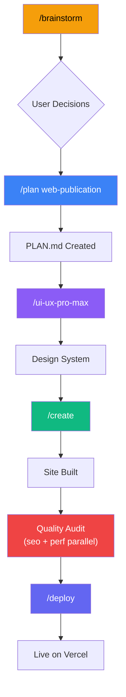

# Agent System Analysis: Markdown → Web Site Generation

> Self-analysis of `.agent` system for the `qgc-web-publication` project

---

## 1. Agent System Overview

The `.agent` kit ("Antigravity Kit") is a general-purpose AI coding framework with:

| Component | Count | Purpose |
|-----------|-------|---------|
| **Agents** | 20 | Role-based AI specialist personas |
| **Skills** | 36+ | Domain-specific knowledge modules |
| **Workflows** | 11 | Slash-command procedures |
| **Scripts** | 2 master + 18 skill-level | Validation & audit tools |
| **Templates** | 13 | Project scaffolding blueprints |

### System Architecture Pattern

```
GEMINI.md (P0 rules)
    ↓
Intelligent Routing → Agent Selection
    ↓
Agent.md (P1 rules) → skills: [skill1, skill2]
    ↓
SKILL.md (P2 rules) → references/, scripts/
```

### Key Operating Model

- **Socratic Gate**: mandatory clarification before complex tasks
- **4-Phase Workflow**: Analysis → Planning → Solutioning → Implementation → Verification
- **Orchestration**: multi-agent coordination via `orchestrator` agent
- **Plan-first**: PLAN.md required before any code

---

## 2. Best-Fit Agents

### 🟢 PRIMARY (Must-use)

| Agent | Role in This Project | Why |
|-------|---------------------|-----|
| `project-planner` | Task breakdown, tech stack decision, PLAN.md | Entry point for any new project. 4-phase methodology. |
| `frontend-specialist` | Build the web site — UI, components, pages, styling | This is a WEB project. All layout, design, responsiveness. |
| `orchestrator` | Coordinate multi-agent flow | Needed to coordinate planner → frontend → SEO → deploy pipeline. |

### 🟡 SECONDARY (Important for quality)

| Agent | Role in This Project | Why |
|-------|---------------------|-----|
| `seo-specialist` | SEO optimization, meta tags, structured data | Publication site needs discoverability. E-E-A-T for technical content. |
| `performance-optimizer` | Core Web Vitals, bundle size | Static content site must be fast. Vercel deployment = Lighthouse matters. |
| `devops-engineer` | Vercel deployment, GitHub integration | README explicitly states: `GitHub → Vercel` flow. |
| `documentation-writer` | Content structure, information architecture | Can help with markdown processing logic, but only on explicit request. |

### 🔴 NOT RELEVANT (Skip entirely)

| Agent | Why Not |
|-------|---------|
| `backend-specialist` | No API/server needed — static site |
| `database-architect` | No database |
| `mobile-developer` | Web only |
| `game-developer` | N/A |
| `security-auditor` | No auth, no user data |
| `penetration-tester` | N/A |
| `test-engineer` | Minimal; only basic E2E after build |
| `debugger` | No existing code to debug |
| `code-archaeologist` | No legacy code |
| `product-manager` | Requirements already defined in README |
| `product-owner` | Requirements already defined |
| `qa-automation-engineer` | Overkill for static site |

---

## 3. Best-Fit Skills

### 🟢 KEY SKILLS

| Skill | Purpose | Used By |
|-------|---------|---------|
| `app-builder` | Tech stack selection, project scaffolding | `project-planner` |
| `frontend-design` | Design system, color, typography, UX psychology | `frontend-specialist` |
| `nextjs-react-expert` | Next.js App Router patterns, SSG, static export | `frontend-specialist` |
| `tailwind-patterns` | Tailwind CSS v4 utilities, responsive design | `frontend-specialist` |
| `plan-writing` | Task breakdown, dependency graph | `project-planner` |
| `seo-fundamentals` | Meta tags, structured data, Core Web Vitals | `seo-specialist` |
| `clean-code` | Global code quality (always active) | All agents |
| `brainstorming` | Socratic questioning for design decisions | `project-planner` |

### 🟡 SUPPLEMENTARY SKILLS

| Skill | Purpose | When |
|-------|---------|------|
| `web-design-guidelines` | Post-implementation audit (100+ rules) | After UI is built |
| `performance-profiling` | Lighthouse, bundle analysis | Before deploy |
| `deployment-procedures` | Vercel deployment workflow | Deploy phase |
| `architecture` | ADR decisions (Next.js vs Astro, etc.) | Planning phase |
| `documentation-templates` | README, docs structure | Final polish |

### 🔴 NOT RELEVANT

> `api-patterns`, `database-design`, `mobile-design`, `game-development`, `red-team-tactics`, `vulnerability-scanner`, `mcp-builder`, `python-patterns`, `powershell-windows`, `i18n-localization`, `strategy-prompt`, `systematic-debugging`, `tdd-workflow`, `testing-patterns`, `webapp-testing`, `server-management`, `geo-fundamentals`

---

## 4. Best-Fit Workflows

### 🟢 PRIMARY WORKFLOWS (Execution order)

| # | Workflow | When | Purpose |
|---|----------|------|---------|
| 1 | `/brainstorm` | First | Decide: site type (docs/presentation/hybrid), tech stack (Next.js vs Astro), design direction |
| 2 | `/plan` | After brainstorm | Generate PLAN.md with full task breakdown, agent assignments, file structure |
| 3 | `/ui-ux-pro-max` | Design phase | Generate design system (colors, typography, style) via Python script |
| 4 | `/create` | Implementation | Scaffold project, coordinate agents, build the site |
| 5 | `/preview` | During development | Start local dev server, verify results |
| 6 | `/deploy` | Final | Pre-flight checks, Vercel deployment |

### 🟡 SUPPLEMENTARY

| Workflow | When |
|----------|------|
| `/enhance` | Post-MVP iterations (add features, pages) |
| `/orchestrate` | If complex multi-agent coordination is needed |

### 🔴 NOT RELEVANT

| Workflow | Why Not |
|----------|---------|
| `/debug` | No existing code to debug |
| `/test` | Minimal testing needed for static site |
| `/status` | Useful but not task-critical |

---

## 5. Recommended Execution Model

### Model: **Phased Orchestration (Hybrid)**

```
Phase 1: Single-agent (sequential)     → brainstorm + plan
Phase 2: Single-agent (sequential)     → design system generation
Phase 3: Single-agent (primary work)   → frontend build
Phase 4: Parallel agents               → SEO + performance audit
Phase 5: Single-agent                  → deploy
```

### Why NOT full multi-agent orchestration?

| Factor | Assessment |
|--------|------------|
| **Project complexity** | Medium — static content site, no backend |
| **Domain overlap** | Low — mostly frontend work |
| **Parallel benefit** | Limited — code generation is sequential |
| **Overhead** | Multi-agent orchestration adds context-passing complexity |

### Where parallel execution IS useful

```
Phase 4 (Quality):
├── seo-specialist     → meta tags, structured data, sitemap
├── performance-optimizer → Lighthouse, bundle analysis
└── Can run in parallel since they work on different concerns
```

### Recommended Orchestration Type

```
orchestrator
  ├── Phase 1: project-planner (solo) → PLAN.md
  ├── Phase 2: frontend-specialist + ui-ux-pro-max → design system
  ├── Phase 3: frontend-specialist (solo) → build site
  ├── Phase 4: [parallel] seo-specialist + performance-optimizer → audit
  └── Phase 5: devops-engineer (solo) → deploy to Vercel
```

---

## 6. Step-by-Step Execution Strategy

### Phase 0: Content Audit (Pre-work)
**Agent:** None (manual / explorer-agent)
**Input:** `source-docs/` (8 markdown files, ~190KB total)
**Actions:**
1. Analyze all 8 documents structure, length, complexity
2. Map content hierarchy and cross-references
3. Identify navigation structure from `00_INDEX.md`
4. Determine content categories (Core Analysis, UI/UX, Testing)

**Output:** Content map with page hierarchy

---

### Phase 1: Brainstorm & Decision
**Workflow:** `/brainstorm markdown-to-web technical publication`
**Agent:** `project-planner` (via brainstorming skill)
**Key Decisions Required:**

| Decision | Options | Recommendation |
|----------|---------|----------------|
| **Site type** | Docs / Presentation / Hybrid | Hybrid (docs structure + premium design) |
| **Framework** | Next.js Static / Astro | Both viable. Next.js if interactive elements needed; Astro if pure content. |
| **Styling** | Tailwind / Vanilla CSS | Tailwind (agent system is optimized for it) |
| **Content processing** | Build-time MDX / Runtime parse | Build-time MDX (Astro) or `next-mdx-remote` (Next.js) |
| **Design style** | Technical docs / Magazine / Dashboard | Requires user input |

**Output:** Design direction decision document

---

### Phase 2: Planning
**Workflow:** `/plan web-publication`
**Agent:** `project-planner`
**Actions:**
1. Create `web-publication.md` plan file
2. Define tech stack with rationale
3. Define file structure
4. Task breakdown with agent assignments
5. Phase X verification checklist

**Output:** `./web-publication.md` in project root

---

### Phase 3: Design System
**Workflow:** `/ui-ux-pro-max`
**Agent:** `frontend-specialist`
**Actions:**
1. Run `search.py "technical documentation maritime engineering" --design-system -p "QGC Web Publication"`
2. Generate color palette, typography, layout rules
3. Persist design system with `--persist`
4. Get user approval on design direction

**Output:** `design-system/MASTER.md`

---

### Phase 4: Implementation
**Workflow:** `/create`
**Agent:** `frontend-specialist`
**Actions:**
1. Scaffold project (Next.js static or Astro)
2. Implement layout components (header, sidebar, footer)
3. Build markdown processing pipeline
4. Create page templates for each document type
5. Implement navigation (sidebar + breadcrumbs)
6. Add syntax highlighting for code blocks
7. Implement responsive design
8. Add search (optional, client-side)

**Template:** `nextjs-static` or `astro-static` (from `app-builder/templates/`)

**Output:** Working static site with all 8 documents rendered

---

### Phase 5: Quality Audit (Parallel)
**Agents:** `seo-specialist` + `performance-optimizer`

| Agent | Actions | Scripts |
|-------|---------|---------|
| `seo-specialist` | Meta tags, sitemap, schema markup, headings audit | `seo_checker.py` |
| `performance-optimizer` | Lighthouse audit, bundle analysis, image optimization | `lighthouse_audit.py`, `bundle_analyzer.py` |

**Additional:** `web-design-guidelines` skill for UX audit (`ux_audit.py`)

**Output:** Audit reports with fix recommendations

---

### Phase 6: Deploy
**Workflow:** `/deploy`
**Agent:** `devops-engineer`
**Actions:**
1. Pre-flight checks (build, lint, type check)
2. Configure Vercel deployment
3. Set up GitHub → Vercel auto-deploy
4. Verify health check

**Output:** Live site on Vercel

---

## 7. First Workflow to Run

> **`/brainstorm markdown-to-web maritime-gcs-publication`**

### Why brainstorm first?

1. **Tech stack is undecided** — Next.js vs Astro is a critical fork
2. **Site type is undecided** — docs-style vs presentation vs hybrid
3. **Design direction is unknown** — technical/dark vs clean/light
4. **Content processing model unclear** — MDX vs runtime parsing
5. The Socratic Gate in GEMINI.md **requires** clarification before complex tasks

### Key questions brainstorm should resolve:

```
1. Site type: "Is this a reference docs site or a presentation/showcase?"
2. Audience: "Who reads this — engineers, product managers, executives?"
3. Tech: "Next.js (richer interactivity) or Astro (content-first, lighter)?"
4. Design: "Technical documentation look or premium branded presentation?"
5. Interactivity: "Do you need interactive diagrams, search, filtering?"
6. Deployment: "Vercel confirmed? Custom domain?"
```

---

## 8. Risks / Limitations / Gaps

### 🔴 Critical Gaps

| Gap | Impact | Mitigation |
|-----|--------|------------|
| **No markdown-to-HTML skill** | Agent system has no specific skill for markdown content processing (MDX, remark, rehype pipelines) | Leverage `nextjs-react-expert` + `app-builder` templates. May need manual markdown pipeline configuration. |
| **No content collections skill** | No specific knowledge for Astro Content Collections or Next.js MDX Remote | Use `astro-static` template as starting point. Manual implementation guidance needed. |
| **Source docs are in Russian** | Some content (headers, descriptions) is in Russian Cyrillic | Decide if site is English, Russian, or bilingual. `i18n-localization` skill available but may be overkill. |

### 🟡 Moderate Risks

| Risk | Impact | Mitigation |
|------|--------|------------|
| **Large documents** | `06_GAP_ANALYSIS.md` is 56KB, `07_TARGET_ARCHITECTURE.md` is 65KB — may need pagination or ToC | Implement client-side ToC + scroll-spy navigation |
| **Cross-document references** | Documents reference each other — need consistent internal linking | Build link resolver during content processing |
| **Overengineered design rules** | `frontend-specialist` has aggressive anti-template rules — but for **docs**, clean/readable IS the goal | Override "anti-standard" rules for documentation context. Readability > creativity for technical content. |
| **Mermaid diagrams in source** | Source docs may contain mermaid diagram syntax | Need mermaid rendering support in the build pipeline |
| **agent system overhead** | Some agent rules (Purple Ban, Socratic Gate, Maestro Auditor) add unnecessary ceremony for a relatively simple project | Acknowledge overhead, follow the minimum required protocol |

### 🟢 Strengths of Current System

| Strength | Value |
|----------|-------|
| **`nextjs-static` template** | Ready-made blueprint for static Next.js + Tailwind + Framer Motion |
| **`astro-static` template** | Purpose-built for content-focused static sites with MDX |
| **`ui-ux-pro-max` workflow** | Python-scripted design system generator — eliminates design guesswork |
| **Verification scripts** | `seo_checker.py`, `lighthouse_audit.py`, `ux_audit.py` — automated quality gates |
| **Deploy workflow** | End-to-end deployment procedure with pre-flight checks |
| **Plan-first methodology** | Forces structured thinking before code — prevents rework |

---

## Summary Decision Matrix



### Agent Usage Summary

| Phase | Agent(s) | Parallel? |
|-------|----------|-----------|
| Brainstorm | `project-planner` | No |
| Plan | `project-planner` | No |
| Design | `frontend-specialist` | No |
| Build | `frontend-specialist` | No |
| Audit | `seo-specialist` + `performance-optimizer` | **Yes** |
| Deploy | `devops-engineer` | No |

### Total agents used: 4-5 (of 20 available)
### Total skills used: 8-10 (of 36 available) 
### Total workflows used: 5-6 (of 11 available)
