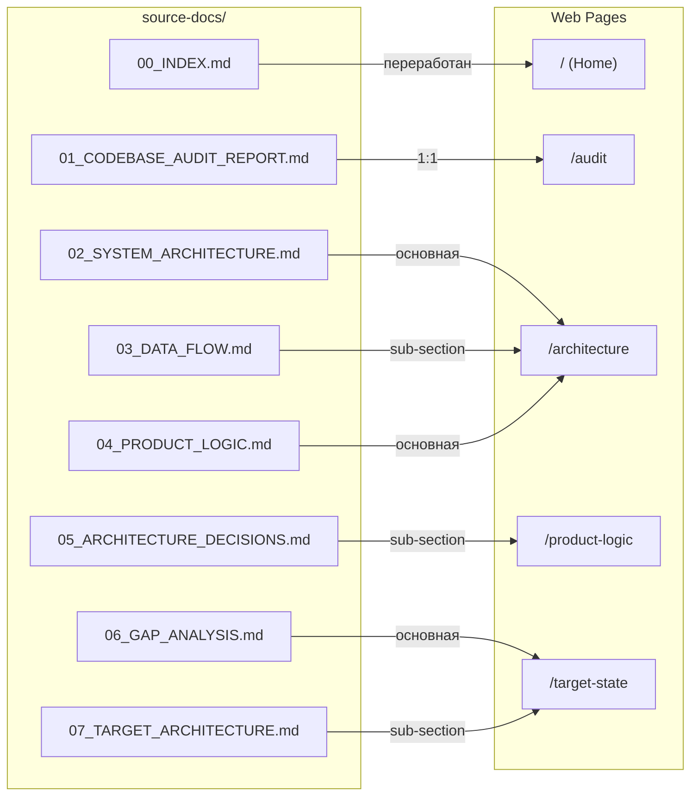

# Publication Plan: QGC Web Publication

> Трансформация markdown-документов `source-docs/` (00–07) в веб-публикацию типа "Technical Book Hybrid"

---

## Scope

### Включено

| Документ | Строк | Размер | Страница сайта |
|----------|-------|--------|----------------|
| `00_INDEX.md` | 45 | 2KB | `/` — Home (переработан в landing) |
| `01_CODEBASE_AUDIT_REPORT.md` | 112 | 13KB | `/audit` |
| `02_SYSTEM_ARCHITECTURE.md` | 102 | 10KB | `/architecture` (основная) |
| `03_DATA_FLOW.md` | 123 | 12KB | `/architecture` (вложенный раздел) |
| `04_PRODUCT_LOGIC.md` | 250 | 22KB | `/product-logic` (основная) |
| `05_ARCHITECTURE_DECISIONS.md` | 78 | 11KB | `/product-logic` (вложенный раздел) |
| `06_GAP_ANALYSIS.md` | 565 | 56KB | `/target-state` (основная) |
| `07_TARGET_ARCHITECTURE.md` | 998 | 65KB | `/target-state` (вложенный раздел) |

**Итого:** 8 документов, ~2273 строк, ~191KB

### Исключено (Phase 2)

Документы 08–15 (UI/UX Analysis, Testing) — будут добавлены через `/enhance` после стабилизации основного сайта.

---

## Структура сайта

### Page Map

```
/                    → Home (overview, навигация, структура проекта)
/audit               → Аудит кодовой базы (01)
/architecture        → Архитектура системы (02 + 03)
  └─ /data-flow      → Потоки данных (03) — sub-section или tab
/product-logic       → Продуктовая логика (04 + 05)
  └─ /decisions      → Архитектурные решения (05) — sub-section или tab
/target-state        → Gap Analysis + Целевая архитектура (06 + 07)
  └─ /architecture   → Target Architecture (07) — sub-section или tab
```

### Маппинг source-docs → страницы



> **Примечание:** На страницах `/architecture`, `/product-logic` и `/target-state` два документа объединяются в одну страницу с tabs или anchor-навигацией. Основной документ — первый, дополнение — второй.

---

## Home Page (`/`)

### Контент

1. **Hero-секция**
   - Заголовок: название проекта (QGroundControl → Maritime GCS)
   - Подзаголовок: краткое описание — "Технический анализ и целевая архитектура наземной станции управления для автономных надводных аппаратов"
   - Визуальный акцент (gradient / illustration)

2. **О проекте** (2–3 параграфа)
   - Что это: комплексный технический аудит QGroundControl
   - Зачем: определение пути трансформации для maritime use case
   - Результат: gap analysis + target architecture для Maritime GCS

3. **Структура документации** (навигационные карточки)
   - 4 карточки → 4 раздела сайта
   - Каждая карточка: иконка + заголовок + 1 предложение + ссылка

4. **Метаданные проекта**
   - Дата анализа: Апрель 2026
   - Статус: Core Analysis — Done
   - Стек: QGroundControl, Qt6/C++, MAVLink, ArduPilot

---

## Навигация

### Sidebar (persistent)

```
📊 Home
├── 🔍 Аудит кодовой базы       → /audit
├── 🏗 Архитектура системы       → /architecture
│   └── Потоки данных            → /architecture#data-flow
├── 💼 Продуктовая логика        → /product-logic
│   └── Архитектурные решения    → /product-logic#decisions
└── 🎯 Целевое состояние        → /target-state
    └── Target Architecture      → /target-state#architecture
```

### Внутристраничная навигация

- **Table of Contents (ToC)** — правая колонка (desktop), collapsed (mobile)
- **Scroll-spy** — активный пункт ToC подсвечивается при скролле
- **Prev / Next** — навигация между секциями внизу каждой страницы

---

## Tech Stack

| Компонент | Технология | Обоснование |
|-----------|-----------|-------------|
| **Framework** | Next.js 14 (Static Export) | `nextjs-static` template в agent system; SSG для максимальной производительности |
| **Язык** | TypeScript | Type safety, DX |
| **Styling** | Tailwind CSS v4 | Agent system оптимизирована под Tailwind; utility-first |
| **Markdown** | `next-mdx-remote` + remark/rehype | Обработка .md файлов на этапе сборки |
| **Mermaid** | `remark-mermaid` или client-side render | Диаграммы в source-docs |
| **Syntax Highlight** | `rehype-pretty-code` (Shiki) | Подсветка code blocks |
| **Animations** | Framer Motion | Micro-interactions, page transitions |
| **Icons** | Lucide React | Lightweight, tree-shakable |
| **Deploy** | Vercel | Автодеплой из GitHub |

### Markdown Pipeline

```
source-docs/*.md
    → remark (parse → AST)
    → remark-gfm (tables)
    → remark-mermaid (diagrams)
    → rehype (HTML)
    → rehype-pretty-code (syntax highlight)
    → React components
```

---

## Обработка контента

### Проблема больших документов

| Документ | Размер | Стратегия |
|----------|--------|-----------|
| `06_GAP_ANALYSIS.md` | 56KB / 565 строк | ToC + anchor-навигация внутри страницы |
| `07_TARGET_ARCHITECTURE.md` | 65KB / 998 строк | ToC + collapsible sections для подробностей |
| Остальные | 10–22KB | Стандартная отрисовка |

### Cross-document references

Source-docs ссылаются друг на друга (например, `06_GAP_ANALYSIS.md` ссылается на `01`, `04`, `14`). Необходимо:
- Заменить `01_CODEBASE_AUDIT_REPORT.md` → `/audit`
- Заменить `04_PRODUCT_LOGIC.md` → `/product-logic`
- Ссылки на документы 08–14 — оставить как text (без ссылки), пока страницы не созданы

### Mermaid диаграммы

Документы 02, 06, 07 содержат mermaid-блоки. Варианты:
- **Рекомендация:** Server-side render через `@mermaid-js/mermaid-cli` на этапе сборки
- **Fallback:** Client-side render через `<Mermaid />` компонент

### Таблицы

Все документы содержат GFM-таблицы. `remark-gfm` обрабатывает их автоматически. Стилизация через Tailwind `prose` классы.

---

## Файловая структура проекта

```
qgc-web-publication/
├── source-docs/               # Исходные markdown (не изменяются)
├── src/
│   ├── app/
│   │   ├── layout.tsx         # Root layout (sidebar + metadata)
│   │   ├── page.tsx           # Home page
│   │   ├── audit/
│   │   │   └── page.tsx       # 01_CODEBASE_AUDIT_REPORT
│   │   ├── architecture/
│   │   │   └── page.tsx       # 02 + 03
│   │   ├── product-logic/
│   │   │   └── page.tsx       # 04 + 05
│   │   └── target-state/
│   │       └── page.tsx       # 06 + 07
│   ├── components/
│   │   ├── layout/
│   │   │   ├── Sidebar.tsx
│   │   │   ├── Header.tsx
│   │   │   ├── Footer.tsx
│   │   │   └── TableOfContents.tsx
│   │   ├── content/
│   │   │   ├── MarkdownRenderer.tsx
│   │   │   ├── MermaidDiagram.tsx
│   │   │   ├── CodeBlock.tsx
│   │   │   └── ContentTabs.tsx
│   │   └── ui/
│   │       ├── Card.tsx
│   │       ├── NavigationCard.tsx
│   │       └── PrevNextNav.tsx
│   ├── lib/
│   │   ├── markdown.ts        # MDX processing pipeline
│   │   ├── content.ts         # Document loading + cross-ref resolver
│   │   └── navigation.ts      # Sidebar structure definition
│   └── styles/
│       └── globals.css
├── public/
│   └── og-image.png           # Social share image
├── next.config.js             # Static export config
├── tailwind.config.ts
├── tsconfig.json
└── package.json
```

---

## Задачи (Task Breakdown)

### Phase 1: Scaffolding (Задачи 1–3)

| # | Задача | Зависимости | Результат |
|---|--------|------------|-----------|
| 1 | Scaffold Next.js project (static export + TypeScript + Tailwind) | — | Рабочий `npm run dev` |
| 2 | Настроить markdown pipeline (remark + rehype + mermaid + syntax highlight) | 1 | Один .md файл рендерится |
| 3 | Реализовать content loader (`lib/content.ts`) — чтение source-docs/ | 1 | Функция `getDocument(slug)` |

### Phase 2: Layout & Navigation (Задачи 4–6)

| # | Задача | Зависимости | Результат |
|---|--------|------------|-----------|
| 4 | Layout: sidebar + header + main area + ToC | 1 | Persistent layout с навигацией |
| 5 | Sidebar navigation component | 4 | Рабочий sidebar с активным пунктом |
| 6 | Table of Contents + scroll-spy | 4 | ToC в правой колонке |

### Phase 3: Pages (Задачи 7–11)

| # | Задача | Зависимости | Результат |
|---|--------|------------|-----------|
| 7 | Home page (hero + cards + metadata) | 4 | Landing страница |
| 8 | `/audit` page | 2, 3, 4 | Страница аудита |
| 9 | `/architecture` page (02 + 03 combined) | 2, 3, 4 | Архитектура + Data Flow |
| 10 | `/product-logic` page (04 + 05 combined) | 2, 3, 4 | Продуктовая логика + ADR |
| 11 | `/target-state` page (06 + 07 combined) | 2, 3, 4 | Gap Analysis + Target Arch |

### Phase 4: Polish (Задачи 12–15)

| # | Задача | Зависимости | Результат |
|---|--------|------------|-----------|
| 12 | Responsive design (mobile) | 4–11 | Адаптивная вёрстка |
| 13 | Cross-document link resolver | 3 | Внутренние ссылки работают |
| 14 | SEO: meta tags, Open Graph, sitemap | 7–11 | SEO-оптимизация |
| 15 | Prev/Next navigation между разделами | 5 | Навигация внизу страниц |

### Phase 5: Verify & Deploy (Задачи 16–18)

| # | Задача | Зависимости | Результат |
|---|--------|------------|-----------|
| 16 | Build static export (`next build`) | все | Папка `out/` без ошибок |
| 17 | Lighthouse audit (target: 90+ по всем метрикам) | 16 | Отчёт Lighthouse |
| 18 | Deploy to Vercel | 16 | Live URL |

---

## Открытые вопросы

> [!IMPORTANT]
> Требуется решение перед началом implementation:

1. **Объединение документов на одной странице:** 
   - `/architecture` = 02 + 03 — через tabs или через anchor-секции на одной длинной странице?
   - Рекомендация: **anchor-секции** (проще для навигации и SEO)

2. **Язык интерфейса:**
   - Source-docs написаны на русском. UI элементы (sidebar, навигация, meta) — тоже на русском?
   - Рекомендация: **полностью русский** (контент + UI), English code comments

3. **Дизайн-система:**
   - Запускать `/ui-ux-pro-max` для генерации палитры и типографики, или определить быстро (тёмная тема, техническая эстетика)?
   - Рекомендация: **быстрое определение** — тёмная тема, моноширинный акцент, минимальная палитра (2–3 цвета)

---

## Verification Plan

### Автоматические проверки

```bash
# Build без ошибок
npm run build

# TypeScript проверка
npx tsc --noEmit

# Lint
npx next lint
```

### Browser-верификация

- Все 5 страниц загружаются
- Sidebar навигация работает
- ToC scroll-spy работает
- Mermaid диаграммы рендерятся
- Таблицы стилизованы
- Mobile responsive
- Prev/Next навигация

### Lighthouse

- Performance: ≥ 90
- Accessibility: ≥ 90
- Best Practices: ≥ 90
- SEO: ≥ 90
