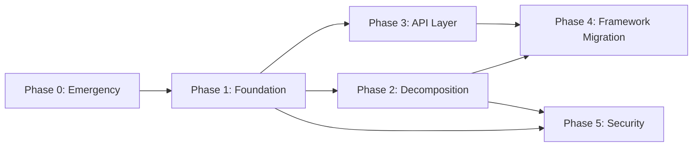

# 12_MODERNIZATION_ROADMAP.md — Mission Planner Modernization Roadmap

**Version:** 1.1 (self-reviewed)  
**Date:** 2026-04-07  
**Scope:** Итоговый документ — приоритизированный план модернизации  
**Basis:** Документы 03–11 архитектурного аудита  

---

## 1. Executive Summary

Mission Planner — зрелый, функционально богатый GCS с ~200K строк C# кода. Однако архитектура 2010-х годов создаёт критические риски:

| Метрика | Текущее состояние |
|---------|------------------|
| **Тестовое покрытие** | < 0.1% (20 тестов / 200K строк) |
| **God-objects** | 4 класса > 4800 строк каждый |
| **Empty catches** | 352 в 4 core файлах |
| **Static singletons** | ~20 глобальных точек связи |
| **Deprecated methods** | 40 `[Obsolete]` в MAVLinkInterface |
| **Security vulnerabilities** | HTTP API без auth, plugins без sandbox |
| **Target framework** | .NET Framework 4.7.2 (maintenance mode) |
| **Cross-platform** | Только Windows (WinForms UI) |

---

## 2. Target Architecture Vision

```
┌─────────────────────────────────────────────────────────────┐
│                    TARGET ARCHITECTURE                       │
│                                                              │
│  ┌──────────┐  ┌───────────┐  ┌──────────┐  ┌───────────┐  │
│  │  Web UI   │  │ Desktop UI│  │Mobile UI │  │  CLI      │  │
│  │ (Blazor/  │  │ (MAUI/    │  │ (MAUI)   │  │ (Console) │  │
│  │  React)   │  │  Avalonia)│  │          │  │           │  │
│  └─────┬─────┘  └─────┬─────┘  └─────┬────┘  └─────┬─────┘  │
│        │              │              │              │        │
│  ┌─────┴──────────────┴──────────────┴──────────────┴─────┐  │
│  │              API Layer (gRPC / REST)                     │  │
│  │              Authentication + Authorization              │  │
│  └─────────────────────┬───────────────────────────────────┘  │
│                        │                                      │
│  ┌─────────────────────┴───────────────────────────────────┐  │
│  │              Application Services                        │  │
│  │  ┌──────────┐ ┌───────────┐ ┌─────────┐ ┌───────────┐  │  │
│  │  │ Vehicle  │ │ Mission   │ │ Teleme- │ │ Firmware  │  │  │
│  │  │ Manager  │ │ Manager   │ │  try    │ │ Manager   │  │  │
│  │  └────┬─────┘ └─────┬─────┘ └────┬────┘ └─────┬─────┘  │  │
│  └───────┼──────────────┼────────────┼────────────┼────────┘  │
│          │              │            │            │           │
│  ┌───────┴──────────────┴────────────┴────────────┴────────┐  │
│  │              Core Domain (netstandard/net8)              │  │
│  │  MAVLink │ CurrentState │ Params │ Settings │ Plugins   │  │
│  └────────────────────────┬────────────────────────────────┘  │
│                           │                                   │
│  ┌────────────────────────┴────────────────────────────────┐  │
│  │              Transport Layer                             │  │
│  │  Serial │ TCP │ UDP │ WebSocket │ MQTT                  │  │
│  └─────────────────────────────────────────────────────────┘  │
└─────────────────────────────────────────────────────────────┘
```

---

## 3. Phased Roadmap

### Phase 0: Emergency Fixes (1-2 недели)
> Нулевые инвестиции, максимальный ROI по безопасности

| # | Действие | Файл(ы) | Effort | Risk mitigated |
|---|---------|---------|--------|---------------|
| 0.1 | Включить `dotnet test` в CI | `.github/workflows/main.yml` | 2 часа | R01 |
| 0.2 | HTTP API: bind localhost only + env var для override | `httpserver.cs:62` | 1 час | R03 |
| 0.3 | Replace `giveComport` с `SemaphoreSlim` | `MAVLinkInterface.cs` | 4 часа | R02 |
| 0.4 | Add `log.Error(ex)` во все пустые catch | 4 core файла | 4 часа | R06 |
| 0.5 | ADSB TTL — expire targets > 60s | `MainV2.cs:433` | 1 час | R10 |
| 0.6 | Route history limit (max 10K points) | `FlightData.cs` | 1 час | R10 |

**Deliverable:** CI с тестами, безопасный HTTP, no silent failures

---

### Phase 1: Foundation (1-2 месяца)
> Создание инфраструктуры для декомпозиции

#### 1.1 Testing Infrastructure
| # | Действие | Effort |
|---|---------|--------|
| 1.1.1 | Unit tests для MAVLink packet parsing (генерация → парсинг → verify) | 3 дня |
| 1.1.2 | Unit tests для `BoardDetect` pattern — extend to all parsers | 2 дня |
| 1.1.3 | Mock `ICommsSerial` → integration tests без hardware | 3 дня |
| 1.1.4 | CI gate: test must pass before merge | 1 час |

#### 1.2 Core Abstractions
| # | Действие | Effort |
|---|---------|--------|
| 1.2.1 | Extract `IVehicleManager` interface from `MainV2.comPort` access | 3 дня |
| 1.2.2 | Extract `ITelemetryProvider` from `CurrentState` | 2 дня |
| 1.2.3 | Extract `ISettingsProvider` from `Settings.Instance` | 1 день |
| 1.2.4 | Extract `IMissionManager` from `FlightPlanner` mission logic | 3 дня |
| 1.2.5 | DI container — use `Microsoft.Extensions.DependencyInjection` | 2 дня |

#### 1.3 Communication Hardening
| # | Действие | Effort |
|---|---------|--------|
| 1.3.1 | `ArrayPool<byte>` для MAVLink packet buffers | 1 день |
| 1.3.2 | True async `ReadAsync()` в `readPacketAsync()` | 3 дня |
| 1.3.3 | UI update throttle — batch BeginInvoke to 30fps max | 2 дня |

**Deliverable:** Testable core, async I/O, proper locking

---

### Phase 2: Decomposition (2-4 месяца)
> Разбиение god-objects на сервисы

#### 2.1 MAVLinkInterface decomposition

```
MAVLinkInterface (6898 строк)
    ├── MAVLinkTransport         → packet read/write, framing
    ├── MAVLinkCommandService    → doCommand, doARM, setMode
    ├── MAVLinkParameterService  → getParamList, setParam
    ├── MAVLinkMissionService    → setWPTotal, setWP, getWP
    ├── MAVLinkFirmwareService   → firmware upload logic
    └── MAVLinkSubscriptionBus   → observer pattern for packets
```

#### 2.2 MainV2 decomposition

```
MainV2 (4826 строк)
    ├── ConnectionManager        → connect/disconnect logic
    ├── SerialReaderService      → read loop
    ├── JoystickService          → joystick input → RC override
    ├── PluginHostService        → plugin lifecycle
    ├── HttpApiService           → HTTP server
    └── ApplicationShell         → UI shell only (minimal)
```

#### 2.3 FlightData decomposition

```
FlightData (6692 строк)
    ├── TelemetryDisplayService  → QuickView, gauges, HUD
    ├── MapDisplayService        → GMap markers, routes, overlays
    ├── ActionDispatchService    → MAVLink action buttons
    ├── DataLoggingService       → graph data, tuning
    └── FlightDataView           → UI shell only
```

**Deliverable:** Каждый god-object → 4-6 focused services

---

### Phase 3: API Layer (2-3 месяца)
> Отделение UI от бизнес-логики

#### 3.1 Internal API

| Component | Interface | Methods |
|-----------|----------|---------|
| `IVehicleManager` | Vehicle lifecycle | Connect, Disconnect, GetVehicles, SetActive |
| `ITelemetryStream` | Realtime data | Subscribe(messageType), GetCurrent() |
| `IMissionManager` | Mission CRUD | Upload, Download, SetWP, GetWPs |
| `IParameterManager` | Param operations | GetAll, Set, Refresh |
| `IFirmwareManager` | Firmware ops | GetAvailable, Flash, Verify |

#### 3.2 External API

| Feature | Technology | Replaces |
|---------|-----------|----------|
| REST API | ASP.NET Core Minimal API | httpserver.cs raw TCP |
| WebSocket | SignalR | Custom WebSocket handler |
| Authentication | JWT Bearer tokens | None (current: open) |
| API spec | OpenAPI/Swagger | None |

**Deliverable:** Clean internal API + modern external API with auth

---

### Phase 4: Framework Migration (3-6 месяцев)
> Переход на modern .NET

#### 4.1 Migration path

```
Current:  net472 (WinForms) + netstandard2.0 (ExtLibs)
     ↓
Step 1:   net8.0-windows (WinForms on modern .NET) + netstandard2.0
     ↓
Step 2:   net8.0-windows (WinForms) + net8.0 (shared libs)
     ↓
Step 3:   net8.0 (cross-platform core) + platform-specific UI
```

#### 4.2 UI migration options

| Option | Pros | Cons | Effort |
|--------|------|------|--------|
| **MAUI** | Microsoft official, mobile | Still young, limited Desktop | Very High |
| **Avalonia** | Cross-platform, WPF-like | Smaller community | High |
| **Blazor Hybrid** | Web + Desktop, C# skills | Performance concerns | Medium |
| **Web-only (React/Vue)** | Maximum reach | Full rewrite, no native | Very High |

**Рекомендация:** Avalonia для Desktop + Blazor для Web dashboard. Core logic shared через net8.0 libraries.

#### 4.3 Breaking changes matrix

| Change | Impact | Migration path |
|--------|--------|---------------|
| net472 → net8.0 | Не все NuGet пакеты совместимы | Test each dependency |
| WinForms → Avalonia | Full UI rewrite | Parallel development |
| DirectShowLib → cross-platform video | No DirectShow on Linux/Mac | FFmpeg/LibVLC |
| System.Speech → cross-platform TTS | No System.Speech on Linux | Piper/eSpeak |
| IronPython → Python.NET или Roslyn scripting | API change for scripts | Migration guide |

**Deliverable:** Modern .NET, cross-platform ready

---

### Phase 5: Security & Quality (ongoing)
> Непрерывное улучшение

| # | Действие | Effort | Phase |
|---|---------|--------|-------|
| 5.1 | Plugin code signing + manifest | 2 недели | After Phase 2 |
| 5.2 | DPAPI/Keychain для credentials | 1 неделя | After Phase 4 |
| 5.3 | HTTP API: TLS + CORS | 1 неделя | After Phase 3 |
| 5.4 | Enforce CA1031 in .editorconfig | 1 день | Phase 0 |
| 5.5 | Remove 40 `[Obsolete]` methods | 2 дня | Phase 2 |
| 5.6 | Code coverage gate (>60%) | Ongoing | After Phase 1 |

---

## 4. Migration Dependencies



---

## 5. Effort Estimate

| Phase | Длительность | FTE | Рисков закрывает |
|-------|-------------|-----|-----------------|
| **Phase 0** | 1-2 недели | 1 | R01, R02, R03, R06, R10 |
| **Phase 1** | 1-2 месяца | 1-2 | R01, R07, R09 |
| **Phase 2** | 2-4 месяца | 2-3 | R08, R09, R12 |
| **Phase 3** | 2-3 месяца | 1-2 | R03, R04 |
| **Phase 4** | 3-6 месяцев | 2-3 | R05 |
| **Phase 5** | Ongoing | 0.5 | R04, R11 |
| **Total** | **~12-18 месяцев** | **2-3 FTE average** | **All 12 risks** |

---

## 6. What NOT to do

| Анти-паттерн | Почему |
|-------------|--------|
| **"Big rewrite from scratch"** | 200K строк ≈ 50 человеко-лет. Incremental migration only. |
| **Migrate UI first** | UI — самая видимая, но наименее ценная часть. Core first. |
| **Add features during migration** | Feature freeze на миграционные модули. |
| **Skip Phase 0** | Emergency fixes = highest ROI, lowest effort. |
| **Use Electron** | C# ecosystem уже имеет cross-platform solutions. |
| **Write tests after migration** | Tests = safety net ДЛЯ migration. Write first. |

---

## 7. Success Metrics

| Метрика | Текущее | Phase 1 target | Phase 4 target |
|---------|---------|---------------|---------------|
| **Test coverage** | < 0.1% | > 30% core | > 60% |
| **God-object lines** | 6898 max | < 2000 max | < 500 max |
| **Empty catches** | ~100+ | 0 | 0 |
| **CI test gate** | Off | On (blocking) | On + coverage gate |
| **Cross-platform** | Windows only | Windows + API | Win + Linux + Mac + Web |
| **Security score** | F | C (auth + logging) | A (auth + TLS + sandbox) |
| **Avg response time** | ~50ms (polling) | < 20ms (async) | < 5ms (event-driven) |

---

*Аудит Mission Planner завершён. Документы 03–12 составляют полную картину архитектуры, рисков и пути модернизации.*
