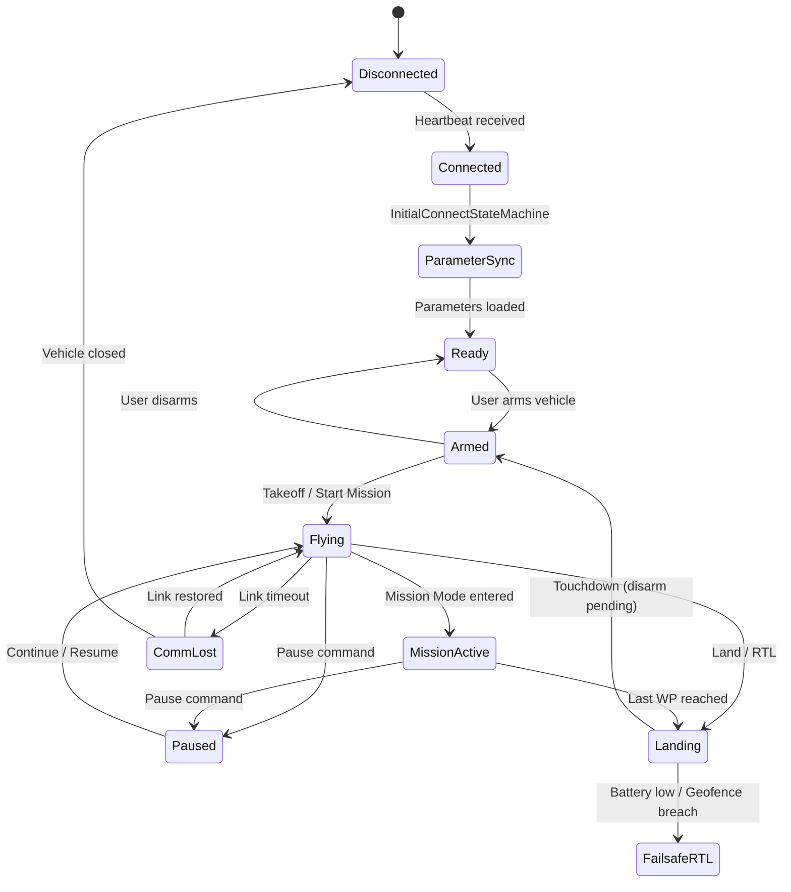

# Глубокий анализ Fly View — рабочий экран оператора

Данный документ представляет собой результат reverse-engineering анализа экрана **Fly View** QGroundControl, выполненного на основании исходного QML-кода, привязок данных (bindings), контроллеров и менеджеров. Каждый вывод привязан к конкретному файлу-источнику.

---

## 1. Визуальные зоны экрана

Fly View (`FlyView.qml`) состоит из следующих визуальных зон, уложенных слоями (z-order) друг поверх друга:

```
┌─────────────────────────────────────────────────────────────────┐
│  TOOLBAR (FlyViewToolBar)                                       │
│  [QGC Logo] [MainStatus] [Disconnect] [FlightMode] ... [Indic] │
├──────┬──────────────────────────────────────────────────────┬────┤
│      │                                                      │    │
│ TOOL │             MAP / VIDEO (FlyViewMap)                  │ MV │
│ STRIP│                                                      │ PAN│
│      │         ┌────────────────────────┐                   │ EL │
│      │         │   VehicleWarnings      │                   │    │
│      │         │  (центр, поверх карты) │                   │    │
│      │         └────────────────────────┘                   │    │
│      │                                                      │    │
│      │  ┌─────┐                                             │    │
│      │  │ PiP │            GuidedActionConfirm (toolbar)    ├────┤
│      │  │Video│                                             │TELE│
│      │  └─────┘     ┌──────────────────┐     ┌──────────┐  │METR│
│      │              │ VirtualJoystick  │     │Instrument│  │Y   │
│      │              │ (нижняя часть)   │     │ Panel    │  │BAR │
└──────┴──────────────┴──────────────────┴─────┴──────────┴──┘
                                                    ↕ GuidedValueSlider
                                                    (справа, при вызове)
```

**Слои (от нижнего к верхнему):**
1. **Map / Video** (`FlyViewMap.qml` / `FlyViewVideo.qml`) — основная подложка.
2. **Widget Layer** (`FlyViewWidgetLayer.qml`) — UI-оверлей с панелями и индикаторами.
3. **Custom Layer** (`FlyViewCustomLayer.qml`) — точка расширения для кастомных сборок.
4. **Toolbar** (`FlyViewToolBar.qml`) — верхняя полоса навигации и статуса.
5. **GuidedValueSlider** (`GuidedValueSlider.qml`) — всплывающий слайдер (самый верхний z-order).

---

## 2. Полная инвентаризация элементов Fly View

### 2.1 Toolbar (верхняя полоса)
*Источник: `FlyViewToolBar.qml`, `FlyViewToolBarIndicators.qml`*

| Элемент | Файл-источник | Тип | Описание |
|---|---|---|---|
| **QGC Logo Button** | `FlyViewToolBar.qml:78` | Кнопка | Открывает диалог выбора экрана (`showToolSelectDialog`) |
| **MainStatusIndicator** | `MainStatusIndicator.qml` | Индикатор + действие | Показывает общий статус Vehicle (Connected / Disarmed / Armed / Flying). Клик раскрывает панель с деталями: GPS, Battery, RC, Health checks |
| **Disconnect Button** | `FlyViewToolBar.qml:92` | Кнопка | Появляется **только** при потере связи (`communicationLost`). Вызывает `_activeVehicle.closeVehicle()` |
| **FlightModeIndicator** | `FlightModeIndicator.qml` | Выпадающее меню | Показывает текущий режим полета (Manual, Auto, Guided...). Клик открывает список доступных режимов |
| **GuidedActionConfirm** | `GuidedActionConfirm.qml` | Интерактив (Delay Button) | Появляется в центре тулбара при запросе Guided-команды. Содержит `QGCDelayButton` (требует удержания для подтверждения) |
| **Toolbar Indicators (правая часть)** | `FlyViewToolBarIndicators.qml` | Набор иконок | Динамически загружаются из `corePlugin.toolBarIndicators` и `_activeVehicle.toolIndicators`. Включают: GPS, Battery, RC RSSI, Telemetry RSSI, Joystick, Gimbal, RemoteID, MAVLink Signing и т.д. |
| **ParameterDownloadProgress** | `ParameterDownloadProgress.qml` | Индикатор прогресса | Отображает шкалу загрузки параметров при первом подключении |

### 2.2 Tool Strip (левая вертикальная панель)
*Источник: `FlyViewToolStripActionList.qml`*

Вертикальная стрипа кнопок основных действий. Каждая кнопка — это `GuidedToolStripAction`, видимость которого определяется `GuidedActionsController`.

| Кнопка | Действие | Когда видна | Источник визибилити |
|---|---|---|---|
| **3D View** | Переключение в 3D режим | Всегда (если поддерживается) | `Viewer3DShowAction` |
| **Preflight Checklist** | Открывает чеклист перед полетом | Если включен в настройках (`useChecklist`) | `PreFlightCheckListShowAction` |
| **Takeoff** | Запрос на взлёт | `!_vehicleFlying && _canTakeoff` | `GuidedActionTakeoff` |
| **Land** | Запрос на посадку | `_vehicleArmed && _vehicleFlying && !fixedWing && !_vehicleInLandMode` | `GuidedActionLand` |
| **RTL (Return)** | Возврат на точку запуска | `_vehicleArmed && _vehicleFlying && !_vehicleInRTLMode` | `GuidedActionRTL` |
| **Pause** | Зависание / остановка | `_vehicleArmed && _vehicleFlying && !_vehiclePaused` | `GuidedActionPause` |
| **Additional Actions (⋮)** | Раскрывает panel с доп. действиями | Если есть доступные доп. действия | `FlyViewAdditionalActionsButton` |
| **Gripper** | Управление механическим захватом | Если дрон поддерживает gripper | `FlyViewGripperButton` |

### 2.3 Additional Actions Panel (раскрывается из ⋮)
*Источник: `FlyViewAdditionalActionsList.qml`*

| Действие | Когда доступно |
|---|---|
| **Start Mission** | Миссия загружена, aппарат не летит, ready to arm |
| **Continue Mission** | Миссия есть, аппарат в воздухе, но не в Mission Mode |
| **Change Altitude** | Аппарат летит, не в режиме Mission |
| **Change Loiter Radius** | Аппарат в forward flight, GoTo circle видим |
| **Land Abort** | Только для fixed wing в режиме посадки |
| **Change Speed** | Аппарат летит, есть лимиты скорости |

### 2.4 Карта (центральная зона)
*Источник: `FlyViewMap.qml`*

| Элемент карты | Что отображает | Источник данных |
|---|---|---|
| **VehicleMapItem** (для каждого Vehicle) | Иконка дрона с направлением | `multiVehicleManager.vehicles` → `object.coordinate` |
| **Trajectory Polyline** | Красная линия пройденного пути | `_activeVehicle.trajectoryPoints` |
| **PlanMapItems** | Маршрут миссии (путевые точки, линии) | `PlanMasterController` → `missionController.visualItems` |
| **GeoFenceMapVisuals** | Геозона (граница) | `_geoFenceController` |
| **Rally Points** | Точки возврата (маркер "R") | `_rallyPointController.points` |
| **Camera Trigger Points** | Точки фотосъемки | `_activeVehicle.cameraTriggerPoints` |
| **GoTo Location marker** | Метка "Go here" при клике на карту | Действие пользователя → `gotoLocationItem` |
| **Orbit Circle** | Визуальный круг для команды "Orbit" | `orbitMapCircle` |
| **ROI Marker** | Метка "ROI here" (точка интереса) | `_activeVehicle.roiCoord` |
| **ADSB Vehicles** | Маркеры воздушных судов из ADS-B | `adsbVehicleManager.adsbVehicles` |
| **Obstacle Distance Overlay** | Радар препятствий вокруг аппарата | `ObstacleDistanceOverlayMap` |
| **ProximityRadarMapView** | Зона обнаружения дальномером | `ProximityRadarMapView` |
| **MapScale** | Масштабная линейка | `MapScale.qml`, auto-hide |

**Контекстное меню при клике на карту** (появляется если GuidedActions разрешены):
- Go to location
- Orbit at location
- ROI at location
- Set home here
- Set Estimator Origin
- Set Heading
- Координаты (Lat/Lon)

### 2.5 Нижняя правая зона
*Источник: `FlyViewBottomRightRowLayout.qml`*

| Элемент | Описание | Источник данных |
|---|---|---|
| **TelemetryValuesBar** | Настраиваемая сетка телеметрических показаний (altitudeRelative, groundSpeed, heading и др.) | `HorizontalFactValueGrid` → биндинг к Fact объектам Vehicle |
| **FlyViewInstrumentPanel** | Виджет приборной панели (компас, авиагоризонт или custom QML). Выбирается пользователем через `flyViewSettings.instrumentQmlFile2` | `SelectableControl` из `QGC.settingsManager` |

### 2.6 Верхняя правая зона
*Источник: `FlyViewTopRightPanel.qml`, `FlyViewTopRightColumnLayout.qml`*

**Multi-Vehicle Panel** (TopRightPanel) — появляется **только** при подключении 2+ аппаратов:
- Список всех Vehicle с возможностью выбора (чекбоксы)
- Кнопки: Select All / Deselect All
- Массовые действия: Arm, Disarm, Start Mission, Pause (для выбранных)
- Страница 2 (swipe): Photo/Video контроль камеры

**Одиночный режим** (TopRightColumnLayout) — когда 1 Vehicle:
- TerrainProgress (прогресс загрузки тайлов рельефа)
- PhotoVideoControl (управление камерой, если есть MAVLink Camera Manager)

### 2.7 Предупреждения и оверлеи
*Источник: `VehicleWarnings.qml`*

| Предупреждение | Когда появляется | Где |
|---|---|---|
| **"No GPS Lock for Vehicle"** | `requiresGpsFix && !coordinate.isValid` | Центр экрана |
| **Pre-arm Error** | `!armed && prearmError && !healthAndArmingCheckReport.supported` | Центр экрана |

### 2.8 Video PiP и стриминг
*Источник: `FlyViewVideo.qml`, `FlightDisplayViewVideo.qml`*

- Видео-виджет может быть в PiP-режиме (маленькое окно внизу слева) или полноэкранном режиме.
- Double-click переключает в полноэкранный режим видео (скрывает все UI элементы через `QGroundControl.videoManager.fullScreen`).
- Содержит `OnScreenGimbalController` (управление подвесом протяжкой по видео) и `OnScreenCameraTrackingController` (трекинг объекта).
- `ProximityRadarVideoView` — наложение радара препятствий поверх видео.

### 2.9 Виртуальный джойстик
*Источник: `VirtualJoystick.qml`*

- Два Touch-пада (левый + правый) для ручного управления.
- Скрыт если `virtualJoystick` выключен в настройках или связь через High Latency Link.
- Отправляет `_activeVehicle.virtualTabletJoystickValue()` на частоте **25 Hz**.
- **Для Rover/Boat:** Специальное поведение — `yAxisPositiveRangeOnly` отключается (`!_activeVehicle.rover`), что позволяет давать задний ход (ось Y работает в обе стороны).

---

## 3. Классификация элементов: отображение vs действие

### Только отображают статус (Read-only)
- Toolbar Indicators (GPS, Battery, RC, Telemetry RSSI, ESC)
- TelemetryValuesBar (FactValueGrid)
- VehicleWarnings
- Trajectory Polyline
- GeoFence Visuals / Rally Points / Camera Trigger Points
- MapScale
- TerrainProgress
- ParameterDownloadProgress
- ObstacleDistanceOverlay
- ADSB Vehicle markers

### Выполняют действия (Interactive)
- MainStatusIndicator (раскрывает панели Arm/Disarm)
- FlightModeIndicator (переключение режима)
- Tool Strip кнопки (Takeoff, Land, RTL, Pause)
- GuidedActionConfirm (подтверждение команд)
- GuidedValueSlider (установка высоты/скорости)
- Map context menu (Go to location, Orbit, ROI, Set Home)
- VirtualJoystick (ручное управление)
- PhotoVideoControl (съёмка/запись)
- Orbit/GoTo circle drag (изменение радиуса)
- ROI edit (перемещение точки интереса)
- MultiVehicle Panel кнопки (массовые операции)
- Disconnect Button

---

## 4. Полный каталог действий оператора из Fly View

*Источник: `GuidedActionsController.qml` — полный список actionCode и условия видимости*

| # | Действие | actionCode | Метод Vehicle | Требует подтверждения |
|---|---|---|---|---|
| 1 | Arm | `actionArm` (4) | `_activeVehicle.armed = true` | Да (Delay Button) |
| 2 | Force Arm | `actionForceArm` (21) | `_activeVehicle.forceArm()` | Да |
| 3 | Disarm | `actionDisarm` (5) | `_activeVehicle.armed = false` | Да |
| 4 | Emergency Stop | `actionEmergencyStop` (6) | `_activeVehicle.emergencyStop()` | Да |
| 5 | Takeoff | `actionTakeoff` (3) | `guidedModeTakeoff(altMeters)` | Да + слайдер высоты |
| 6 | Land | `actionLand` (2) | `guidedModeLand()` | Да |
| 7 | RTL / Smart RTL | `actionRTL` (1) | `guidedModeRTL(smartRTL)` | Да + checkbox Smart RTL |
| 8 | Pause | `actionPause` (17) | `guidedModeChangeAltitude(alt, true)` | Да + слайдер высоты |
| 9 | Start Mission | `actionStartMission` (12) | `_activeVehicle.startMission()` | Да (с задержкой) |
| 10 | Continue Mission | `actionContinueMission` (13) | `_activeVehicle.startMission()` | Да (с задержкой) |
| 11 | Resume Mission | `actionResumeMission` (14) | `missionController.resumeMission(idx)` | Из диалога "Mission Complete" |
| 12 | Go To Location | `actionGoto` (8) | `guidedModeGotoLocation(coord)` | Да (Клик на карту → confirm) |
| 13 | Change Altitude | `actionChangeAlt` (7) | `guidedModeChangeAltitude(delta)` | Да + слайдер |
| 14 | Change Speed | `actionChangeSpeed` (22) | `guidedModeChangeGroundSpeed/Airspeed(ms)` | Да + слайдер |
| 15 | Change Loiter Radius | `actionChangeLoiterRadius` (30) | `guidedModeGotoLocation(coord, radius)` | Да + drag на карте |
| 16 | Orbit | `actionOrbit` (10) | `guidedModeOrbit(center, radius, alt)` | Да + слайдер + drag на карте |
| 17 | ROI | `actionROI` (20) | `guidedModeROI(coord)` | Нет (прямое выполнение) |
| 18 | Set Home | `actionSetHome` (24) | `doSetHome(coord)` | Да |
| 19 | Set Estimator Origin | `actionSetEstimatorOrigin` (25) | `setEstimatorOrigin(coord)` | Да |
| 20 | Set Waypoint | `actionSetWaypoint` (9) | `setCurrentMissionSequence(idx)` | Да |
| 21 | Land Abort | `actionLandAbort` (11) | `abortLanding(50)` | Да (auto-popup) |
| 22 | Change Heading | `actionChangeHeading` (27) | `guidedModeChangeHeading(coord)` | Да |
| 23 | Set Flight Mode | `actionSetFlightMode` (26) | `_activeVehicle.flightMode = data` | Да |
| 24 | MV Arm | `actionMVArm` (28) | Цикл по selectedVehicles | Да |
| 25 | MV Disarm | `actionMVDisarm` (29) | Цикл по selectedVehicles | Да |
| 26 | MV Start Mission | `actionMVStartMission` (19) | Цикл по selectedVehicles | Да |
| 27 | MV Pause | `actionMVPause` (18) | Цикл по selectedVehicles | Да |

---

## 5. Данные, подаваемые в Fly View из backend

| Поток данных | C++ источник | QML binding path | Частота обновления |
|---|---|---|---|
| Координаты GPS | `Vehicle::coordinate` | `_activeVehicle.coordinate` | ~5 Hz (MAVLink `GLOBAL_POSITION_INT`) |
| Высота (rel/abs) | `Vehicle::altitudeRelative` | `_activeVehicle.altitudeRelative.value` | ~5 Hz |
| Скорость | `Vehicle::groundSpeed` / `airSpeed` | `_activeVehicle.groundSpeed.value` | ~5 Hz |
| Крены/тангаж | `Vehicle::roll`, `pitch`, `heading` | Через FactGroup | ~10 Hz (MAVLink `ATTITUDE`) |
| Статус ARM | `Vehicle::armed` | `_activeVehicle.armed` | По событию |
| Режим полета | `Vehicle::flightMode` | `_activeVehicle.flightMode` | По событию |
| Батарея | `Vehicle::batteries` | Через BatteryIndicator | ~1 Hz |
| GPS Lock / Sat count | `Vehicle::gps` FactGroup | Через GPSIndicator | ~1 Hz |
| RC RSSI | `Vehicle::rcRSSI` | `_activeVehicle.rcRSSI` | ~1 Hz |
| Телеметрия RSSI | `MAVLinkProtocol` | TelemetryRSSIIndicator | ~1 Hz |
| Траектория | `Vehicle::trajectoryPoints` | `_activeVehicle.trajectoryPoints` | По новой точке |
| Точки миссии | `MissionController::visualItems` | PlanMapItems model | По изменению |
| Видеострим | `VideoManager` / GStreamer | `FlightDisplayViewVideo` | Непрерывно (фреймы) |
| Pre-arm ошибки | `Vehicle::prearmError` | `VehicleWarnings` | По событию |
| Данные препятствий | `Vehicle::obstacleDistance` | `ObstacleDistanceOverlay*` | ~5 Hz |
| Health & Arming Checks | `Vehicle::healthAndArmingCheckReport` | MainStatusIndicator | По событию |

---

## 6. Состояния и режимы, влияющие на доступность элементов

*Логика полностью определена в `GuidedActionsController.qml`, строки 124-150*

| Состояние / Свойство | UI-эффект |
|---|---|
| **`_activeVehicle == null`** | Весь UI инертен. Нет кнопок действий, нет телеметрии. ToolStrip скрыт. |
| **`!initialConnectComplete`** | Показывается `ParameterDownloadProgress`. Кнопки Guided-действий не активны. |
| **`!_vehicleArmed`** | Видны: Arm, Force Arm, Start Mission (если миссия загружена). Скрыты: Land, RTL, Pause, Change Alt, GoTo. |
| **`_vehicleArmed && !_vehicleFlying`** | Видны: Disarm, Start Mission. Скрыты: все "в полёте" действия. |
| **`_vehicleArmed && _vehicleFlying`** | Видны: Emergency Stop, RTL, Land, Pause, GoTo Location, Change Alt, Change Speed, Orbit, ROI. Скрыт: Arm, Start Mission. |
| **`_missionActive`** | Скрыты: Change Alt, Change Speed, Orbit (нельзя вмешиваться в автоматическую миссию). Видны: Pause. |
| **`_vehiclePaused`** | Скрыт: Pause. Видны: Continue Mission, Change Alt. |
| **`communicationLost`** | Появляется кнопка "Disconnect". Действия блокированы. |
| **`_fixedWingOnApproach`** | Появляется Land Abort (auto-popup). Скрыт: Pause. |
| **`fullScreen` (Video)** | Скрыты: Toolbar, ToolStrip, WidgetLayer, все панели. Только видео на весь экран. |
| **`_useChecklist && _enforceChecklist`** | Arm/Takeoff/StartMission заблокированы пока чеклист не пройден (`CheckListPassed`). |

---

## 7. Поведение в зависимости от стадии (connected / armed / mission active / failsafe)



Каждый переход меняет набор видимых/доступных UI-элементов согласно таблице из раздела 6.

---

## 8. Релевантность для надводного аппарата (Boat Scenario)

### Что уже адаптировано в QGC для rover/boat

1. **Vehicle Class:** `MAV_TYPE_SURFACE_BOAT` маппится на `VehicleClassRoverBoat` (`QGCMAVLink.cc:182`). Это значит, что QGC **знает** о лодках и обрабатывает их как подтип класса Rover.
2. **Joystick:** Для rover/boat `yAxisPositiveRangeOnly` отключен (`VirtualJoystick.qml:65,77`), что даёт задний ход (throttle может быть отрицательным).
3. **Pre-flight Checklist:** Для rover используется `RoverChecklist.qml` (`PreFlightCheckList.qml:72`). Проверяет батарею, GPS, RC, сенсоры, миссию и weather. **Нет** проверок пропеллеров и высотных параметров.
4. **Terrain data:** Для `MAV_TYPE_SURFACE_BOAT` и `MAV_TYPE_SUBMARINE` рельеф земли **не загружается** (`VisualMissionItem.cc:32`). Это оптимизация: водным аппаратам рельеф не нужен.
5. **Firmware Plugin:** ArduPilot Rover firmware отдельно обрабатывает Boat (frame class = 2, `APMAirframeComponentController.cc:253`). В режимах полёта есть специфичные для лодки: `SAILBOAT_TACK`, `SAILBOAT_MOTOR_3POS`.

### Элементы, нерелевантные для boat (aerial-first)

| UI элемент | Почему нерелевантен |
|---|---|
| **Кнопка Takeoff** | У лодки нет "взлёта". Она arm-ится и начинает движение. |
| **Кнопка Land** | Лодка не садится. Скрыта через `!_activeVehicle.fixedWing`, но по умолчанию видна для rover — **предположение**: может быть нерелевантна, но не скрыта системно для rover. |
| **Change Altitude** | Не имеет смысла для надводного аппарата. |
| **Altitude slider (Guided)** | Все слайдеры высоты (`SliderType.Altitude/Takeoff`) нерелевантны. |
| **Artificial Horizon / Pitch indicator** | Авиагоризонт бесполезен на воде (нет крена > 10°). |
| **Orbit** | Команда orbit с altitude — воздушная операция. |
| **ADSB Vehicles** | ADS-B — авиационный протокол, для надводных аппаратов не применим. |
| **Land Abort** | Команда прерывания посадки — только для fixed wing. |
| **Terrain Progress** | Рельеф не загружается для boat (отключено кодом). |
| **Camera Trigger Points** | Фотограмметрия: актуально для дронов, но **предположение**: может быть релевантно при гидрографической съёмке. |

### Элементы, особенно важные для boat

| UI элемент | Почему важен |
|---|---|
| **Карта + VehicleMapItem** | Основной инструмент контроля. Позвиция аппарата на водной поверхности. |
| **Trajectory Polyline** | Критичен для навигации — видеть пройденный путь. |
| **GoTo Location** | Ключевая команда: отправить лодку в указанную точку. |
| **Change Speed** | Управление скоростью хода (ground speed). |
| **Change Heading** | Задать курс лодки (поворот). |
| **Start / Continue Mission** | Основной сценарий — автономное следование маршруту. |
| **Pause** | Остановить движение (лодка дрейфует). |
| **RTL (Return)** | Вернуть лодку к точке старта. |
| **VirtualJoystick** | Ручное управление рулём и газом (адаптирован для rover — двусторонний throttle). |
| **GPS Indicator** | Критичен — на воде нет визуальных ориентиров. |
| **Battery Indicator** | Расход энергии на движение по воде. |
| **GeoFence Visuals** | Визуализация акватории, за которую нельзя выходить. |

---

## 9. Сводная таблица всех UI-элементов

| UI элемент | Зона экрана | Что показывает / делает | Откуда берёт данные | Когда доступен | Релевантность для boat |
|---|---|---|---|---|---|
| QGC Logo | Toolbar, left | Навигация между экранами | — | Всегда | ✅ Да |
| MainStatusIndicator | Toolbar, left | Статус аппарата, Arm/Disarm | `Vehicle.*` | Vehicle connected | ✅ Да |
| FlightModeIndicator | Toolbar, left | Текущий режим + переключение | `_activeVehicle.flightMode` | Vehicle connected | ✅ Да |
| GuidedActionConfirm | Toolbar, center | Подтверждение Guided-команд | `GuidedActionsController` | При вызове действия | ✅ Да |
| Toolbar Indicators | Toolbar, right | GPS, Battery, RC, Telem RSSI... | Repeater по Vehicle.toolIndicators | Vehicle connected | ✅ Да |
| Disconnect Button | Toolbar, left | Разрыв связи | `vehicleLinkManager.communicationLost` | Только при потере связи | ✅ Да |
| ParameterDownloadProgress | Toolbar, overlay | Прогресс загрузки параметров | `ParameterManager` | При первом подключении | ✅ Да |
| ToolStrip: Takeoff | Left strip | Запрос на взлет | `GuidedActionsController` | Not flying, can takeoff | ❌ Нерелевантна |
| ToolStrip: Land | Left strip | Запрос на посадку | `GuidedActionsController` | Armed, flying, not fixedWing | ⚠️ Сомнительно |
| ToolStrip: RTL | Left strip | Return to Launch | `GuidedActionsController` | Armed, flying | ✅ Да |
| ToolStrip: Pause | Left strip | Остановка / зависание | `GuidedActionsController` | Armed, flying, not paused | ✅ Да |
| ToolStrip: Additional Actions | Left strip | Доп. действия (menu) | `FlyViewAdditionalActionsList` | Если есть видимые действия | ✅ Да |
| ToolStrip: Gripper | Left strip | Управление захватом | `FlyViewGripperButton` | Если поддерживается | ⚠️ Возможно |
| ToolStrip: PreFlight Checklist | Left strip | Чеклист готовности | `PreFlightCheckList` | Если включен | ✅ Да |
| VehicleMapItem | Map, center | Иконка аппарата + heading | `_activeVehicle.coordinate` | Vehicle connected | ✅ Критичен |
| Trajectory Polyline | Map | Пройденный путь | `_activeVehicle.trajectoryPoints` | Vehicle connected | ✅ Критичен |
| PlanMapItems | Map | Маршрут миссии | `MissionController.visualItems` | Миссия загружена | ✅ Да |
| GeoFence Visuals | Map | Геозона | `_geoFenceController` | Geofence задан | ✅ Важен |
| Rally Points | Map | Точки возврата | `_rallyPointController.points` | Rally points заданы | ✅ Да |
| GoTo marker ("Go here") | Map | Целевая точка | Клик по карте | Vehicle flying | ✅ Критичен |
| Orbit Circle | Map | Зона орбитирования | Клик по карте | Vehicle flying | ❌ Нерелевантен |
| ROI marker | Map | Точка интереса камеры | Клик по карте / телеметрия | Vehicle flying, ROI supported | ⚠️ Зависит от payload |
| ADSB Vehicles | Map | Воздушные суда | `adsbVehicleManager` | Данные ADS-B есть | ❌ Нерелевантен |
| Camera Trigger Points | Map | Точки фотосъемки | activVehicle.cameraTriggerPoints | Камера активна | ⚠️ Возможно (гидрография) |
| Map Context Menu | Map, popup | Go/Orbit/ROI/Home/Heading | Клик по карте | Vehicle connected | ✅ Да |
| MapScale | Map, overlay | Масштаб карты | `FlightMap` zoom level | Не мини-экран | ✅ Да |
| ObstacleDistanceOverlay | Map overlay | Дальномер препятствий | Vehicle obstacle distance | Датчик подключен | ⚠️ Возможно (для навигации) |
| TelemetryValuesBar | Bottom-right | Факты телеметрии (alt, speed) | `HorizontalFactValueGrid` | Vehicle connected | ✅ Да (speed, heading) |
| InstrumentPanel | Bottom-right | Компас / Авиагоризонт / Custom | `flyViewSettings.instrumentQmlFile2` | Always (configurable) | ⚠️ Только компас |
| VehicleWarnings | Center overlay | "No GPS Lock" / Pre-arm error | `_activeVehicle.prearmError` | Ошибка есть | ✅ Да |
| VirtualJoystick | Bottom | Ручное управление (2 touchpad) | `virtualTabletJoystickValue()` | Включен в настройках | ✅ Критичен |
| PiP Video/Map | Bottom-left | Альтернативный вид (PiP) | `VideoManager.hasVideo` | Видео доступно | ⚠️ Зависит от камеры |
| MV Panel: Vehicle List | Top-right | Список подключенных аппаратов | `multiVehicleManager.vehicles` | 2+ аппарата | ⚠️ При рое лодок |
| MV Panel: Mass Actions | Top-right | Arm/Disarm/Start/Pause (batch) | `multiVehicleManager.selectedVehicles` | 2+ аппарата | ⚠️ При рое лодок |
| PhotoVideoControl | Top-right | Фото/видео камеры | MAVLink Camera Manager | Камера есть | ⚠️ Зависит от payload |
| TerrainProgress | Top-right | Прогресс загрузки рельефа | `_activeVehicle.terrain` | Рельеф загружается | ❌ Не загружается для boat |
| GuidedValueSlider | Right edge | Установка высоты / скорости | `GuidedActionsController.setupSlider` | При действии с параметром | ⚠️ Только speed |
| FlyViewCustomLayer | Full overlay | Точка расширения для custom builds | — | Всегда (пустой по умолчанию) | ✅ Потенциально |

---

## 10. Сценарий использования Fly View для симуляции лодки

### Типовой flow оператора:

1. **Запуск QGC → подключение к SITL** (ArduRover, `MAV_TYPE_SURFACE_BOAT`).
2. **Ожидание синхронизации параметров** — наблюдать `ParameterDownloadProgress` в Toolbar.
3. **Проверка Ready-состояния** — `MainStatusIndicator` должен показать пройденные Health checks. Зеленый = ready.
4. **Переключение в PlanView → создание маршрута** из нескольких путевых точек на воде → Upload на "борт".
5. **Возврат в FlyView** → появляется PlanMapItems (маршрут отрисован на карте).
6. **Arm** → нажатие через ToolStrip или MainStatusIndicator. Подтверждение через Delay Button.
7. **Start Mission** → кнопка или авто-popup (если `enableAutomaticMissionPopups`). Аппарат начинает движение.
8. **Мониторинг** → наблюдать VehicleMapItem (движение иконки), TrajectoryPolyline (красный след), TelemetryValuesBar (скорость, heading).
9. **Вмешательство (если нужно):**
    - Pause → остановить движение
    - GoTo Location (клик на карту) → направить к точке
    - Change Speed → слайдер скорости
10. **Завершение миссии** → `FlyViewMissionCompleteDialog` предложит удалить или оставить план.
11. **Disarm** → кнопка через MainStatusIndicator.

### Что проверить руками в QGC (Test Checklist)

- [ ] Подключить SITL ArduRover с `MAV_TYPE=11` (SURFACE_BOAT). Убедиться, что QGC корректно определяет тип (в MainStatusIndicator).
- [ ] Убедиться, что **RoverChecklist** загружается при вызове Pre-Flight Checklist.
- [ ] Проверить, что **Takeoff** кнопка скрыта или неактивна для boat (или убедиться, что она ведёт себя так же, как Arm).
- [ ] Проверить, что **Land** кнопка имеет осмысленное поведение (или скрыта).
- [ ] Загрузить маршрут из нескольких Waypoints. Убедиться, что terrain query не запрашивается для boat.
- [ ] Выполнить Start Mission → наблюдать последовательное прохождение точек (подсветка WP).
- [ ] Во время движения использовать **Pause** → убедиться, что аппарат останавливается.
- [ ] Во время движения использовать **GoTo Location** (клик на карту) → убедиться, что лодка меняет курс.
- [ ] Включить **VirtualJoystick** → проверить, что throttle-ось работает в обе стороны (вперед/назад).
- [ ] Включить **Change Speed** → проверить, что слайдер корректно применяет ограничения ground speed.
- [ ] Проверить **Change Heading** → клик на карту → задать направление.
- [ ] Проверить **GeoFence** — создать зону и убедиться, что геозона визуализируется на карте.
- [ ] Проверить **RTL** → аппарат должен вернуться к точке запуска.
- [ ] Проверить **Altitude-related UI** (Change Alt) → должен быть скрыт или неактивен (для поверхностного аппарата бессмысленен). **Предположение**: система не скрывает его автоматически для rover — это потенциальный UX-баг.
- [ ] Проверить **InstrumentPanel** — какой виджет отображается (компас или авиагоризонт). Для boat оптимален только компас.
- [ ] Проверить поведение при **Communication Lost** → появление Disconnect, блокировка guided actions.
