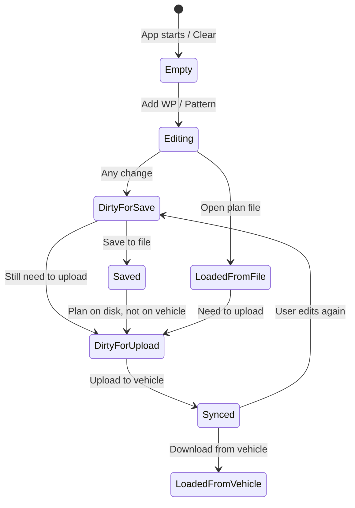

# Глубокий анализ Plan View — экран планирования миссий

Документ построен на reverse-engineering анализе QML-кода Plan View (~15 файлов) и привязанных backend-контроллеров. Каждый вывод ссылается на конкретный файл-источник.

---

## 1. Структура экрана Plan View

Plan View (`PlanView.qml`) занимает весь экран приложения и состоит из следующих визуальных зон:

```
┌─────────────────────────────────────────────────────────────────┐
│  PLAN TOOLBAR (PlanViewToolBar)                                 │
│  [QGC Logo] [Open] [Save] [Upload] [Clear] [☰] [Rally help]    │
├──────┬──────────────────────────────────────────────────────┬────┤
│      │                                                      │    │
│TOOL  │            MAP (FlightMap "MissionEditor")            │ R  │
│STRIP │                                                      │ I  │
│      │  ┌─WP1────WP2────WP3────WP4┐                        │ G  │
│[Take]│  │  ●──────●──────●──────●  │  ← Mission Lines      │ H  │
│[Pat] │  │         ↗      ↗      ↗  │  ← Direction Arrows   │ T  │
│[WP]  │  │    [Split ◇]             │                        │    │
│[ROI] │  └──────────────────────────┘                        │ P  │
│[Land]│                                                      │ A  │
│[Stat]│  GeoFence ▬▬▬  Rally ⊕                              │ N  │
│      │  Vehicle Icon (if connected)                         │ E  │
│      │                                  [Layer.Switcher]    │ L  │
│      │                                                      │    │
├──────┴──────────────────────────────────────────────────────┴────┤
│  BOTTOM STATUS BAR (missionStatus)                               │
│  [⛰ Terrain] [📊 Stats]  TerrainProfile / MissionStats          │
└─────────────────────────────────────────────────────────────────┘
```

### Ключевые слои (z-order от нижнего к верхнему):
1. **FlightMap** (`editorMap`) — основная карта с элементами миссии.
2. **MissionItemMapVisual** (Repeater) — маркеры WP, линии маршрута, direction arrows.
3. **GeoFenceMapVisuals** — визуализация геозон.
4. **RallyPointMapVisuals** — маркеры точек возврата.
5. **VehicleMapItem** — иконки подключённых аппаратов.
6. **ToolStrip** — левая панель инструментов.
7. **PlanViewRightPanel / PlanTreeView** — правая панель с деревом элементов плана.
8. **Layer Switcher** — переключатель слоёв (Mission / Fence / Rally).
9. **PlanViewToolBar** — верхняя панель с кнопками файлов и синхронизации.
10. **missionStatus** — нижняя панель со статистикой и профилем рельефа.

---

## 2. Режимы работы (Editing Layers)

Plan View работает в **трёх режимах** (слоях), переключаемых через Layer Switcher:

| Layer | Константа | Что редактируется | Элементы на карте |
|---|---|---|---|
| **Mission** | `_layerMission = 1` | Путевые точки, паттерны, Takeoff, Land | WP маркеры, линии маршрута, direction arrows, split indicator |
| **Fence** | `_layerFence = 2` | Геозоны (полигоны и круги) | Полигоны/круги inclusion/exclusion |
| **Rally** | `_layerRally = 3` | Точки аварийного возврата | Rally point маркеры |

**Поведение:** Когда активен один слой, элементы других слоёв отображаются с `opacity: 0.5` и переходят в неинтерактивный режим (`interactive: false`).

*Источник: `PlanView.qml:39-41, 345-346, 419-434`*

---

## 3. Toolbar Plan View — кнопки и действия

*Источник: `PlanToolBarIndicators.qml`, `PlanViewToolBar.qml`*

| Кнопка | Действие | Backend метод | Условия |
|---|---|---|---|
| **Open** | Загрузить план из `.plan` файла | `_planMasterController.loadFromFile(file)` | Предупреждение при несохранённых изменениях |
| **Save** | Сохранить план на диск | `_planMasterController.saveToCurrent()` или `.saveWithCurrentName()` | Подсветка (primary) при `dirtyForSave` |
| **Upload** | Загрузить план на борт аппарата | `_planMasterController.sendToVehicle()` | Pre-check: не во время активной миссии; проверка firmware/vehicle type; подсветка при `dirtyForUpload` |
| **Clear** | Очистить план | `_planMasterController.removeAll()` (offline) или `.removeAllFromVehicle()` (online) | Подтверждение через Dialog |
| **☰ Menu** → Download | Скачать план с аппарата | `_planMasterController.loadFromVehicle()` | Предупреждение при несохранённых изменениях |
| **☰ Menu** → Save as KML | Экспорт в KML формат | `_planMasterController.saveToKml(file)` | Минимум 2 visual items |

**Progress Bar:** При upload/download отображается прогресс (`progressPct`) внизу toolbar — зелёная полоса + надпись "Syncing Mission" / "Done".

### Pre-upload validation (`PlanMasterController.upload()`):

```
Upload Request
  ├── checkReadyForSaveUpload() — проверка incomplete items / terrain data
  ├── sendToVehiclePreCheck()
  │     ├── StateOk → sendToVehicle()
  │     ├── StateActiveMission → "Pause mission first" dialog
  │     └── StateFirmwareVehicleMismatch → Warning + confirm dialog
  └── sendToVehicle() → MAVLink MISSION_COUNT → MISSION_ITEM_INT...
```

*Источник: `PlanView.qml:99-128`, `PlanToolBarIndicators.qml:33-97`*

---

## 4. Tool Strip — левая панель инструментов

*Источник: `PlanView.qml:440-523`*

Вертикальная полоса кнопок для добавления элементов миссии. **Видна только в слое Mission** (`_layerMission`).

| Кнопка | Иконка | Действие | Видимость | Boat-релевантность |
|---|---|---|---|---|
| **Takeoff** | `/res/takeoff.svg` | Добавить Takeoff item | `isInsertTakeoffValid && !controllerVehicle.rover` | ❌ **Скрыта для rover/boat** |
| **Pattern** | `MapDrawShape.svg` | Добавить комплексный паттерн (Survey, Corridor Scan, Structure Scan) | Всегда (если `flyThroughCommandsAllowed`) | ⚠️ Survey актуален для обследования; остальные — aerial |
| **Waypoint** | `waypoint.svg` | Режим "клик на карту = добавить WP" (toggle) | Всегда | ✅ Основной инструмент |
| **ROI** | `roi.svg` | Режим "клик на карту = добавить ROI" (toggle) | Если `supports.roiMode` | ⚠️ Зависит от payload |
| **Land / Return / Alt Land** | `rtl.svg` | Добавить Return/Land item | `isInsertLandValid` | ⚠️ Return актуален; Land — сомнительна |
| **Stats** | `chevron-double-right.svg` | Показать панель статистики (если скрыта) | Если `missionStatus.hidden` | ✅ Да |

**Режим "Waypoint on Click":** При нажатии кнопки Waypoint она подсвечивается (checked). Каждый клик на карту создаёт новую точку через `insertSimpleItemAfterCurrent(coordinate)`. Повторный клик на кнопку выключает режим.

**Режим "ROI on Click":** Аналогично, но добавляет ROI. Если ROI уже активен, предлагает выбор: Insert ROI или Cancel ROI.

*Источник: `PlanView.qml:466-471, 487-502, 299-337`*

---

## 5. Правая панель — PlanTreeView

*Источник: `PlanViewRightPanel.qml`, `PlanTreeView.qml`*

Правая панель — это **дерево (TreeView)**, показывающее все элементы плана в иерархии. Панель можно сворачивать/разворачивать кнопкой `<` / `>`.

### Структура дерева (группы):

| Группа (nodeType) | Содержимое | Что редактируется |
|---|---|---|
| **planFileGroup** | `PlanInfoEditor.qml` — имя файла плана, выбор firmware/vehicle type, home position | Имя плана, Vehicle Info, Expected Home Position |
| **defaultsGroup** | `MissionDefaultsEditor.qml` — глобальные настройки миссии | Alt Frame, Waypoints Altitude, Flight Speed, Vehicle Speeds |
| **missionGroup** | `MissionItemEditor.qml` (Repeater) — каждый элемент миссии | Параметры каждого WP: altitude, speed, camera, command type |
| **fenceGroup** | `GeoFenceEditor.qml` — редактор геозон | Polygon/Circle fences, inclusion/exclusion, breach return point |
| **rallyGroup** | `RallyPointEditorHeader.qml` + `RallyPointItemEditor.qml` | Rally points: координаты, удаление |
| **transformGroup** | `TransformEditor.qml` — трансформация всего плана | Rotate, Scale, Move all items |

### Автоматическое поведение дерева:

- При первом добавлении WP: planFileGroup и defaultsGroup **автоматически сворачиваются**, missionGroup раскрывается.
- При загрузке нового плана: все группы сворачиваются, missionGroup раскрывается.
- При пустом плане: planFileGroup и defaultsGroup раскрыты (приглашение настроить).
- При выборе элемента: дерево автоматически скроллится к нему.

*Источник: `PlanTreeView.qml:48-104, 162-296`*

---

## 6. Как создаются Waypoints и Mission Items

### Simple Mission Items (Waypoints)

**Способ 1: Клик на карту (основной)**
```
User → Нажимает кнопку "Waypoint" в ToolStrip
  → _addWaypointOnClick = true (toggle mode)
User → Кликает на карту
  → PlanView.qml:328-330
  → insertSimpleItemAfterCurrent(coordinate)
  → _missionController.insertSimpleMissionItem(coordinate, nextIndex, true)
  → MissionController (C++) создаёт SimpleMissionItem
  → Добавляет в visualItems model
  → UI: появляется маркер на карте + запись в PlanTreeView
```

**Способ 2: Split Segment**
```
User → Наводит на линию между WP
  → Появляется SplitIndicator (ромб ◇ посередине линии)
User → Кликает на SplitIndicator
  → _missionController.insertSimpleMissionItem(splitCoord, currentIndex, true)
  → Новый WP вставляется МЕЖДУ двумя существующими
```

**Способ 3: Drag на карте**
```
User → Перетаскивает маркер WP на карте
  → MissionItemMapVisual обновляет coordinate
  → Координаты автоматически синхронизируются с редактором
```

### Complex Mission Items (Patterns)

```
User → Нажимает "Pattern" в ToolStrip
  → Если один тип — создаёт сразу
  → Если несколько типов — показывает DropPanel с кнопками:
    ├── Survey (аэрофотосъёмка по зигзагу)
    ├── Corridor Scan (съёмка вдоль линии)
    └── Structure Scan (облёт структуры)
User → Выбирает тип
  → insertComplexItemAfterCurrent(complexItemName)
  → _missionController.insertComplexMissionItem(name, mapCenter(), nextIndex, true)
```

### Takeoff Item

```
User → Нажимает "Takeoff" в ToolStrip
  → insertTakeoffItemAfterCurrent()
  → _missionController.insertTakeoffItem(mapCenter(), nextIndex, true)
  → В wizard mode: просит кликнуть на карту для Launch location
  → Кнопка "Done" завершает wizard mode
```

**ВАЖНО для boat:** Кнопка Takeoff **скрыта** для rover/boat (`!_planMasterController.controllerVehicle.rover`). Rover/boat не нуждается в takeoff item.

### Land Item

```
User → Нажимает "Land" / "Return" в ToolStrip
  → insertLandItemAfterCurrent()
  → _missionController.insertLandItem(mapCenter(), nextIndex, true)
  → Для MultiRotor: текст кнопки "Return"
  → Для FixedWing: текст "Land" / "Alt Land" (если уже есть Land item)
```

*Источник: `PlanView.qml:198-226, 372-405, 466-514`*

---

## 7. Редактор элемента миссии (MissionItemEditor)

*Источник: `MissionItemEditor.qml`, `SimpleItemEditor.qml`*

Каждый MissionItem в PlanTreeView отображается через `MissionItemEditor`:

### Компоновка:

```
┌─────────────────────────────────────────────┐
│ [🗑] [Waypoint ▾]              [☰ Hamburger]│  ← Заголовок
├─────────────────────────────────────────────┤
│  [Basic] [Camera] [Advanced]   ← Tabs       │  ← Только для current item
│  ┌──────────────────────────────────┐       │
│  │  Alt Frame: Relative ▾          │       │
│  │  Altitude: 30 m  [====⊙===]     │       │
│  │  Flight Speed: [  ] ✅           │       │
│  │  Param1: [  ]                     │       │
│  │  Param2: [  ]                     │       │
│  └──────────────────────────────────┘       │
└─────────────────────────────────────────────┘
```

### Элементы управления:

| Элемент | Функция |
|---|---|
| **🗑 Delete** | Удаляет текущий mission item |
| **Command Picker** (▾) | Меняет тип команды (Waypoint → Loiter → DO_SET_SPEED...) через `MissionCommandDialog` |
| **☰ Hamburger Menu** | Доп. действия: "Move to vehicle position", "Move to previous item position", "Edit position...", "Show all values" (raw MAVLink params) |
| **Tab: Basic** | Altitude (FactTextFieldSlider), combobox facts, text field facts, NaN facts, Flight Speed |
| **Tab: Camera** | Camera section: photo mode, video mode, distance/time triggers |
| **Tab: Advanced** | Расширенные параметры: advanced combo/text/nan facts |

### Важные свойства:

- `isCurrentItem` — только текущий элемент показывает развёрнутый редактор (Loader загружает `editorQml`).
- `readyForSaveState` — если `NotReadyForSaveData`, элемент подсвечивается предупреждающим бордером (оранжевый `?` кружок).
- `wizardMode` — специальный режим для Takeoff (пошаговая инструкция).

*Источник: `MissionItemEditor.qml:13-44, 46-56, 214-301`, `SimpleItemEditor.qml:86-244`*

---

## 8. Загрузка, сохранение и синхронизация миссии

### Жизненный цикл плана:



### Dirty State Tracking:

| Свойство | Что означает | UI-эффект |
|---|---|---|
| `dirtyForSave` | План изменён, не сохранён на диск | Кнопка Save подсвечена (primary) |
| `dirtyForUpload` | План изменён, не загружен на борт | Кнопка Upload подсвечена (primary) |
| `syncInProgress` | Идёт передача данных | Все кнопки заблокированы, показан progress bar |

### Vehicle Change Dialog:

При подключении/отключении аппарата появляется диалог:
- **"Discard Unsaved Changes, Load New Plan From Vehicle"** → сбрасывает текущий план, загружает с борта.
- **"Keep Current Plan"** → оставляет текущий план в редакторе.

*Источник: `PlanView.qml:800-842`, `PlanToolBarIndicators.qml:24-97`*

---

## 9. GeoFence Editor

*Источник: `GeoFenceEditor.qml`*

Редактор геозон доступен при переключении в слой **Fence** (Layer Switcher).

### Функциональность:

| Действие | UI элемент | Backend метод |
|---|---|---|
| Добавить полигональную зону | Кнопка "Polygon Fence" | `_geoFenceController.addInclusionPolygon(topLeft, bottomRight)` |
| Добавить круговую зону | Кнопка "Circular Fence" | `_geoFenceController.addInclusionCircle(topLeft, bottomRight)` |
| Переключить Inclusion/Exclusion | Checkbox для каждого полигона/круга | `object.inclusion = checked` |
| Редактировать зону | Radio button "Edit" | `object.interactive = true` (включает drag вершин на карте) |
| Удалить зону | Кнопка "Del" | `_geoFenceController.deletePolygon(index)` / `.deleteCircle(index)` |
| Задать радиус (круг) | FactTextField | `object.radius` |
| Добавить Breach Return Point | Кнопка | `_geoFenceController.breachReturnPoint = flightMap.center` |
| Удалить Breach Return Point | Кнопка | Сброс координаты |
| Настроить параметры Fence | FactTextField / FactComboBox | `_geoFenceController.params` (fence_action, fence_radius...) |

**Для boat:** Карта GeoFence особенно важна: определяет**акваторию**, за пределы которой аппарат не должен выходить. Breach Return Point задаёт точку возврата при нарушении геозоны.

---

## 10. Rally Points Editor

*Источник: `RallyPointEditorHeader.qml`, `RallyPointItemEditor.qml`, `RallyPointMapVisuals.qml`*

Rally Points — альтернативные точки возврата (ближайшая используется вместо Home при RTL).

| Действие | Метод |
|---|---|
| Добавить Rally Point | Клик на карту в слое Rally → `_rallyPointController.addPoint(coordinate)` |
| Удалить Rally Point | Кнопка в редакторе → `_rallyPointController.removePoint(index)` |
| Переместить Rally Point | Drag маркера на карте |

**Подсказка:** При переключении в слой Rally появляется текст "Click in map to add rally points" в toolbar.

---

## 11. Mission Defaults Editor

*Источник: `MissionDefaultsEditor.qml`*

Настройки, применяемые ко всем новым Waypoints по умолчанию:

| Параметр | Описание | Boat-релевантность |
|---|---|---|
| **Alt Frame** | Глобальный фрейм высоты (Relative / Absolute / CalcAboveTerrain / Terrain) | ⚠️ Для boat не критичен (движение по поверхности) |
| **Waypoints Altitude** | Высота по умолчанию для новых WP | ❌ Нерелевантен для boat (altitude = 0) |
| **Flight Speed** | Скорость полёта (если `specifyFlightSpeed` включен) | ✅ Важен — задаёт скорость движения по маршруту |
| **Vehicle Speeds** → Cruise Speed | Скорость для расчёта времени (не влияет на flight) | ✅ Важен для оценки времени миссии |
| **Vehicle Speeds** → Hover Speed | Скорость зависания (multiRotor / VTOL) | ❌ Нерелевантен для boat |

**Специфика для boat:** Cruise Speed показывается для non-multiRotor vehicles (`!_controllerVehicle.multiRotor`), что включает rover/boat. Hover Speed скрыт.

*Источник: `MissionDefaultsEditor.qml:20-21, 105-151`*

---

## 12. Mission Stats (нижняя панель статистики)

*Источник: `MissionStats.qml`, `TerrainStatus.qml`*

Нижняя панель содержит два переключаемых вида:

### Terrain Profile (⛰):
- Визуальный **профиль рельефа** вдоль маршрута (`TerrainProfile` + `ChartView`).
- Показывает линию полёта относительно земли.
- Маркеры Waypoints на профиле — кликабельные (переход к WP в дереве).
- **Предположение:** для boat terrain profile может быть неинформативен (рельеф дна не отображается, поверхность воды ≈ 0).

### Mission Stats (📊):

| Метрика | Описание | Boat-релевантность |
|---|---|---|
| **Selected Waypoint: Alt diff** | Разница высот между текущим WP и предыдущим | ❌ Всегда ≈ 0 |
| **Selected Waypoint: Azimuth** | Направление от предыдущего WP | ✅ Критичен (курс) |
| **Selected Waypoint: Dist prev WP** | Расстояние до предыдущего WP | ✅ Критичен |
| **Selected Waypoint: Gradient** | Угол наклона (atan(alt_diff/distance)) | ❌ Нерелевантен |
| **Selected Waypoint: Heading** | Направление движения | ✅ Критичен |
| **Total Mission: Distance** | Общее расстояние маршрута | ✅ Критичен |
| **Total Mission: Max telem dist** | Максимальное удаление от базы | ✅ Важен (радиус связи) |
| **Total Mission: Time** | Расчётное время выполнения | ✅ Критичен |
| **Battery: Batteries required** | Количество замен батарей | ✅ Важен |

*Источник: `MissionStats.qml:92-198`*

---

## 13. Plan Info Editor

*Источник: `PlanInfoEditor.qml`*

| Поле | Описание | Boat-релевантность |
|---|---|---|
| **Plan File name** | Имя плана (текстовое поле) | ✅ Да |
| **Vehicle Info** → Firmware | Выбор firmware (PX4 / ArduPilot) — только в offline режиме | ✅ Да |
| **Vehicle Info** → Vehicle Type | Выбор типа аппарата (MultiRotor / FixedWing / Rover...) — только в offline | ✅ Критичен (выбрать Rover) |
| **Expected Home Position** → Altitude (AMSL) | Высота домашней точки | ⚠️ Маловажен |
| **Move To Map Center** | Переместить home на центр карты | ✅ Удобен |

**Offline Editing:** Если аппарат не подключён, пользователь может выбрать firmware и vehicle type из комбобоксов. При подключении аппарата эти поля блокируются и показывают реальные данные.

---

## 14. Сводная таблица всех элементов Plan View

| Элемент / кнопка | Функция | Логика работы | Backend / Manager | Boat-релевантность |
|---|---|---|---|---|
| **Open** (toolbar) | Загрузить .plan файл | FileDialog → `loadFromFile()` | `PlanMasterController` | ✅ Да |
| **Save** (toolbar) | Сохранить на диск | `saveToCurrent()` / `saveWithCurrentName()` | `PlanMasterController` | ✅ Да |
| **Upload** (toolbar) | Загрузить на борт | Pre-check → `sendToVehicle()` → MAVLink | `PlanMasterController` → `MissionController` | ✅ Критичен |
| **Clear** (toolbar) | Очистить план | Confirm dialog → `removeAll()` / `removeAllFromVehicle()` | `PlanMasterController` | ✅ Да |
| **Download** (hamburger) | Скачать с борта | `loadFromVehicle()` | `PlanMasterController` | ✅ Да |
| **Save as KML** (hamburger) | Экспорт в KML | `saveToKml(file)` | `PlanMasterController` | ⚠️ Вторично |
| **Takeoff** (toolstrip) | Добавить Takeoff item | `insertTakeoffItem()` | `MissionController` | ❌ **Скрыта для rover** |
| **Pattern** (toolstrip) | Добавить Survey/CorridorScan | `insertComplexMissionItem()` | `MissionController` | ⚠️ Survey может быть полезен |
| **Waypoint** (toolstrip) | Режим добавления WP кликом | Toggle → `insertSimpleMissionItem()` при клике | `MissionController` | ✅ Основной |
| **ROI** (toolstrip) | Режим добавления ROI кликом | Toggle → `insertROIMissionItem()` при клике | `MissionController` | ⚠️ Зависит от payload |
| **Land / Return** (toolstrip) | Добавить Land/Return item | `insertLandItem()` | `MissionController` | ⚠️ Return актуален |
| **Stats** (toolstrip) | Показать панель статистики | Toggle `showMissionItemStatus` | `PlanViewSettings` | ✅ Да |
| **Layer Switcher** | Mission / Fence / Rally | Изменяет `_editingLayer` | Локальное состояние | ✅ Да |
| **Split Indicator** (◇) | Вставить WP между существующими | Клик → `insertSimpleMissionItem(midpoint)` | `MissionController` | ✅ Да |
| **Direction Arrows** | Стрелки направления на линиях | Read-only, показывают направление | `MissionController.directionArrows` | ✅ Да |
| **Map click → WP** | Добавить WP кликом | `_addWaypointOnClick` mode | `MissionController` | ✅ Основной |
| **Map click → Rally** | Добавить Rally кликом | Layer = Rally → `addPoint()` | `RallyPointController` | ✅ Да |
| **PlanTreeView** | Дерево элементов плана | TreeView с автоколлапсом | `MissionController.visualItemsTree` | ✅ Да |
| **MissionItemEditor** | Редактор параметров WP | Tabs: Basic/Camera/Advanced | `VisualMissionItem` | ✅ Да (без altitude) |
| **Command Picker** | Выбор типа команды WP | `MissionCommandDialog` | `MissionController` | ✅ Да |
| **GeoFenceEditor** | Редактор геозон | Polygon/Circle/BreachReturn | `GeoFenceController` | ✅ Критичен |
| **RallyPointEditor** | Редактор Rally Points | Add/Delete/Move | `RallyPointController` | ✅ Да |
| **PlanInfoEditor** | Имя плана, Vehicle Info, Home | Text fields, ComboBoxes | `PlanMasterController` | ✅ Да |
| **MissionDefaultsEditor** | Глобальные настройки | Alt Frame, Alt, Speed | `MissionController`, Settings | ⚠️ Speed — да; Alt — нет |
| **TerrainStatus** | Профиль рельефа | Chart с линиями terrain/flight | `MissionController.missionTotalDistance` | ❌ Нерелевантен |
| **MissionStats** | Статистика маршрута | Distance, Time, Azimuth, Battery | `MissionController` | ✅ Критичен |
| **Progress Bar** | Прогресс синхронизации | `progressPct` → ширина полосы | `MissionController` | ✅ Да |

---

## 15. Элементы, привязанные к aerial use case

| Элемент | Почему aerial-only | Поведение для rover/boat |
|---|---|---|
| **Takeoff button** | Взлёт — воздушная операция | **Скрыт** программно (`!controllerVehicle.rover`) |
| **Altitude (WP editor)** | Изменение высоты — не актуально | Поле присутствует, но значение ≈ 0 |
| **Alt Frame selector** | Relative/AMSL/Terrain — для воздуха | Присутствует; для boat бессмысленен |
| **Gradient (Stats)** | Угол набора/снижения | Всегда ≈ 0 |
| **Alt diff (Stats)** | Разница высот между WP | Всегда ≈ 0 |
| **Terrain Profile** | Профиль рельефа под маршрутом | Отключён для boat (`VisualMissionItem.cc:32`) |
| **Hover Speed** | Скорость зависания MultiRotor | Скрыт для rover/boat |
| **VTOL Takeoff wizard** | VTOL transition direction | Не появляется для rover |
| **FW Landing Pattern** | Посадочная глиссада fixed wing | Не загружается для rover |
| **Orbit pattern** | Облёт по кругу с altitude | Не релевантен |

---

## 16. Практический flow: сборка и загрузка миссии для лодки в симуляции

### Подготовка

1. **Запустить ArduRover SITL** с `MAV_TYPE=11` (SURFACE_BOAT).
2. **Запустить QGC** → дождаться автоподключения → toolbar показывает "Ready To Fly".

### Создание миссии

3. **Перейти в Plan View** (QGC Logo → Plan).
4. **Проверить Vehicle Info** (правая панель → Plan File → Vehicle Info): должен показывать "Rover" и "ArduPilot".
5. **Настроить Defaults** (правая панель → Mission Defaults):
   - Alt Frame → оставить (не критичен для boat).
   - Waypoints Altitude → **установить 0** (поверхность воды).
   - Flight Speed → задать желаемую скорость хода (например 5 m/s).
6. **Убедиться что Takeoff кнопка отсутствует** в ToolStrip (скрыта для rover — корректное поведение).
7. **Нажать кнопку "Waypoint"** в ToolStrip → она подсветится.
8. **Кликать на карту** в нужных местах → появляются WP маркеры, линии соединяют их стрелками направления.
9. **Для каждого WP** (клик в PlanTreeView):
   - Проверить Altitude = 0.
   - Опционально: задать Flight Speed через tab Basic.
10. **Добавить Return** (кнопка "Land"/"Return" в ToolStrip) → последний элемент маршрута.

### Добавление GeoFence (рекомендуется)

11. **Нажать Layer Switcher** → выбрать Fence (щит).
12. **Нажать "Polygon Fence"** → на карте появится прямоугольник.
13. **Перетащить вершины** полигона, чтобы определить допустимую акваторию.
14. **Убедиться что Inclusion = checked** (зона, внутри которой разрешено).
15. **(Опционально)** Добавить Breach Return Point.

### Добавление Rally Points (опционально)

16. **Нажать Layer Switcher** → выбрать Rally.
17. **Кликнуть на карту** → Rally Point создан.

### Валидация и загрузка

18. **Проверить MissionStats** (внизу): Distance, Time, Max Telem Dist.
19. **Проверить отсутствие `?` индикаторов** на WP (все элементы ReadyForSave).
20. **Нажать "Upload"**:
    - Если Pre-check OK → миссия загружается, progress bar показывает процесс.
    - Если firmware mismatch → предупреждение, подтвердить.
21. **Дождаться "Done"** → progress bar исчезает.
22. **Нажать "Save"** → сохранить на диск как `.plan` файл.

### Переход к выполнению

23. **Переключиться в Fly View** (QGC Logo → Fly).
24. **Arm → Start Mission** (как описано в `11_FLY_VIEW_DEEP_ANALYSIS.md`).

---

## 17. Чеклист для ручного тестирования Plan View с boat

- [ ] **Vehicle Detection:** При подключении SITL Rover/Boat в PlanInfoEditor → Vehicle Info показывает "Rover" и correct firmware.
- [ ] **Takeoff Hidden:** Кнопка Takeoff отсутствует в ToolStrip для rover.
- [ ] **Waypoint Mode:** Toggle Waypoint → клик на карту → WP создаётся с altitude ≈ 0.
- [ ] **WP Editing:** Клик на WP в PlanTreeView → редактор раскрывается → altitude field видим но значение ≈ 0.
- [ ] **Speed Setting:** В MissionDefaultsEditor → Flight Speed задаётся и применяется к WP.
- [ ] **Split Segment:** Навести на линию между WP → SplitIndicator появляется → клик вставляет WP.
- [ ] **Direction Arrows:** Стрелки на линиях показывают направление движения.
- [ ] **GeoFence:** Переключить в Fence layer → создать Polygon Fence → перетащить вершины → Inclusion = true.
- [ ] **Rally Points:** Переключить в Rally layer → клик на карту → Rally Point создаётся.
- [ ] **Upload:** Нажать Upload → Pre-check проходит → progress bar → "Done".
- [ ] **Download:** ☰ → Download → план загружается с борта в редактор.
- [ ] **Save/Open:** Save план → Clear → Open тот же файл → план восстановлен.
- [ ] **Clear:** Clear → подтверждение → план очищен, дерево показывает пустые defaults.
- [ ] **Stats:** Distance, Time, Max Telem Dist — корректные значения.
- [ ] **Terrain Profile:** Профиль рельефа не должен загружаться/отображаться для boat (подтвердить, что графика пустая или нет данных).
- [ ] **CommandPicker:** Изменить тип WP (Waypoint → Command: например DO_SET_SPEED) → параметры обновляются.
- [ ] **Multi-WP Flow:** Создать 5+ WP → перемещать, удалять, вставлять → дерево и карта синхронизированы.
- [ ] **Vehicle Change Dialog:** Отключить SITL → появляется диалог "Vehicle Disconnected" → выбрать "Keep Current Plan".
